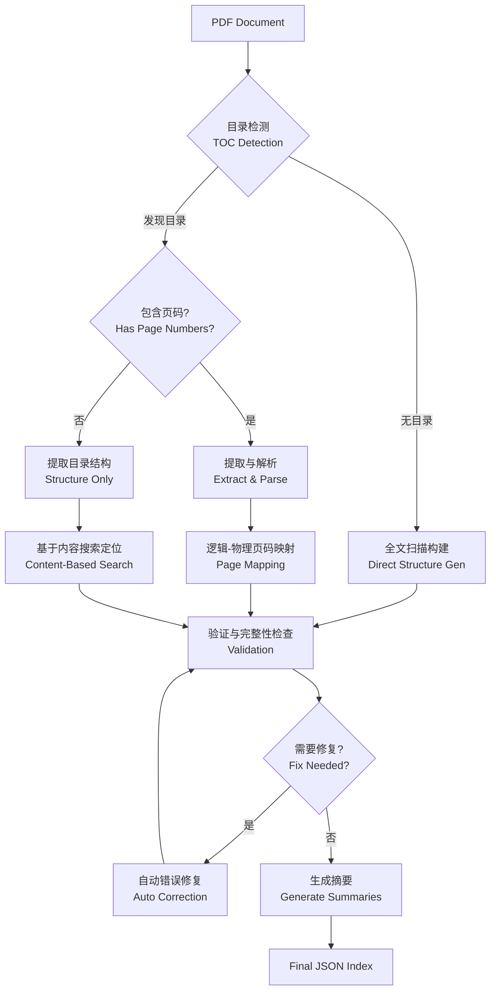

# PageIndex-UV

## 项目简介

**PageIndex-UV** 是一个基于 [PageIndex](https://github.com/VectifyAI/PageIndex) 思想的文档结构化索引与推理问答工具，使用现代化的 Python 工具链进行管理。本项目专注于**非向量化（Vectorless）、基于推理（Reasoning-based）**的方式处理长文档（PDF/Markdown），所有核心代码内联在仓库中，无需外部子模块。

通过解析文档的自然层级结构（目录树），结合 LLM 的推理能力，本工具能够生成带有摘要、页码映射和层级关系的 JSON 索引，为后续的 RAG（检索增强生成）任务提供高精度的上下文定位支持。

### 核心步骤

1. **索引 (Indexing)**: 使用 PageIndex 生成文档的结构化树索引，同时写入 SQLite 缓存节点元数据和页面文本。
2. **简化 (Simplify)**: 推理阶段只保留节点的 `title`、`summary`、`node_id` 和层级结构，减少上下文成本。
3. **推理 (Reasoning)**: 将用户问题与简化后的树结构输入 LLM，返回相关节点 `node_id` 列表。
4. **定位与生成 (Retrieval & Generation)**: 根据命中节点的 `start_index/end_index` 直接从 SQLite 读取页面文本作为上下文，再生成答案。
5. **兜底 (Fallback)**: 若树推理失败或无命中节点，回退到 TOC 页码推理并从 SQLite 读取对应页面。

### 多文档检索 (Multi-Document RAG)

在单文档模式的基础上，`main.py` 现已支持**多文档联合问答**。该模式采用 **L1 → L2 → L3 三层检索 + Token 预算控制** 的架构，解决了传统多文档方案中常见的上下文爆炸和双重 LLM 筛选问题。

```
User Question
    │
    ▼
┌─────────────────┐  L1: 文档目录层 (Doc Catalog)
│ 文档筛选         │  → 从 SQLite `documents` 读取所有文档元数据
│ Top-K 选择       │  → LLM 轻量筛选，最多选出 3 个最相关文档
└────────┬────────┘
         │
         ▼
┌─────────────────┐  L2: 节点召回层 (Node Recall)
│ 逐文档树推理     │  → 对每个命中文档独立调用树推理
│ Top-N 节点/文档  │  → 避免一次性把所有文档的树塞进一个 prompt
└────────┬────────┘
         │
         ▼
┌─────────────────┐  L3: 上下文提取层 (Context Extraction)
│ 页面合并 +       │  → 将节点转页面范围，从 SQLite `pages` 读取
│ Token 预算截断   │  → 总上下文设硬上限（16K tokens）
└────────┬────────┘
         │
         ▼
    Answer Generation
```

这种方式比传统的 Chunking + Vector Search 更精准，因为它保留了文档的上下文逻辑结构。同时，通过 SQLite 缓存页面内容，避免了每次查询都重新解析 PDF，大幅提升了问答响应速度。

---

## 技术栈

本项目基于 **Python 3.13+** 开发，采用以下核心技术和库：

*   **依赖管理**: [uv](https://github.com/astral-sh/uv) - 极速 Python 包管理器和解析器。
*   **数据缓存**: `sqlite3`（内置）- 持久化存储节点元数据和页面文本，加速后续查找。
*   **PDF 处理**:
    *   `PyMuPDF (fitz)`: 高性能 PDF 渲染和文本提取。
    *   `PyPDF2`: PDF 文件操作辅助。
*   **LLM 交互**:
    *   `OpenAI SDK`: 标准化的 LLM 接口调用。
    *   支持多模型后端：OpenAI GPT 系列、阿里云 DashScope (Qwen) 等兼容 OpenAI 协议的模型。
*   **服务化 (MCP)**:
    *   `mcp`: Model Context Protocol SDK，对外暴露标准化 Agent 接口。
    *   `starlette` + `uvicorn`: 轻量级 ASGI Web 框架和服务器，承载 SSE 传输和 HTTP 端点。
    *   `python-multipart`: 处理文件上传的 multipart/form-data 解析。
*   **配置与工具**:
    *   `python-dotenv`: 环境变量管理。
    *   `PyYAML`: 配置文件处理。
    *   `tiktoken`: Token 计数与管理。
    *   `jieba`: 中文分词，用于标签提取和元数据匹配。

---

## 项目结构

```text
.
├── PageIndex/                 # 核心库代码（PageIndex 框架）
│   ├── pageindex/             # 核心包
│   │   ├── page_index.py      # PDF 结构化索引生成逻辑
│   │   ├── page_index_md.py   # Markdown 结构化索引生成逻辑
│   │   └── utils.py           # 通用工具函数 (API 调用, Token 计数等)
│   ├── cookbook/              # Jupyter Notebook 示例
│   └── run_pageindex.py       # 命令行工具入口
├── deploy/                    # 部署配置
│   └── mcp-config.json        # Claude Desktop MCP 配置模板
├── logs/                      # 运行日志和输出结果
├── db.py                      # SQLite 缓存层（节点、页面、文档元数据）
├── main.py                    # 交互式问答主入口（统一多文档入口，命令驱动文档管理）
├── server.py                  # MCP 服务主文件（SSE + API Key 认证）
├── Dockerfile                 # Docker 镜像构建
├── docker-compose.yml         # Docker Compose 服务定义
├── pyproject.toml             # 项目元数据与依赖配置
├── uv.lock                    # 依赖锁定文件
└── .env                       # 环境变量配置文件
```

### 关键文件说明

*   **`db.py`**: 新增的 SQLite 持久化层。包含 `PageIndexDB` 类，负责：
    *   `documents` 表：记录每个 PDF 的文件名、路径、简化后的树结构 JSON 和文档描述 `doc_description`。
    *   `nodes` 表：扁平化存储每个节点的 `node_id`、`title`、`summary`、`start_index`、`end_index` 和 `parent_node_id`。`insert_nodes` 接收调用方准备好的扁平记录列表，避免在持久化层遍历树结构。
    *   `pages` 表：存储每页的预提取文本内容，后续查询直接通过 SQL 读取，无需重新打开 PDF。`insert_pages` 接收调用方提取好的 `(doc_id, page_number, content)` 记录列表。
*   **`main.py`**: 交互式问答入口。启动后直接进入多文档问答提示符，所有已缓存文档自动作为知识库。通过 `/add` 命令索引新文档，`/doc` 命令聚焦单文档，`/list` 查看文档列表。内部复用了统一的 LLM JSON 调用器、节点到页面的转换助手，并预缓存每棵树的 JSON 字符串加速 L1 文档筛选。
*   **`server.py`**: MCP 服务主文件。基于 Starlette + uvicorn 构建，对外暴露 SSE 传输的 MCP 协议端点，同时提供独立的 HTTP `/upload` 文件上传接口和 `/health` 健康检查。内置 API Key 认证（`X-API-Key` Header）和 CORS 中间件，支持 Docker 容器化部署。

---

## 核心功能与实现原理

### 1. PDF 结构化索引 (PDF Structure Indexing)

利用视觉特征和 LLM 推理，自动识别 PDF 的目录（TOC）和层级结构。

#### 实现流程


```mermaid
graph TD
    A[PDF Document] --> B{目录检测<br>TOC Detection};
    B -- 发现目录 --> C{包含页码?<br>Has Page Numbers?};
    B -- 无目录 --> D[全文扫描构建<br>Direct Structure Gen];
    C -- 是 --> E[提取与解析<br>Extract & Parse];
    E --> F[逻辑-物理页码映射<br>Page Mapping];
    C -- 否 --> G[提取目录结构<br>Structure Only];
    G --> H[基于内容搜索定位<br>Content-Based Search];
    D --> I[验证与完整性检查<br>Validation];
    F --> I;
    H --> I;
    I --> J{需要修复?<br>Fix Needed?};
    J -- 是 --> K[自动错误修复<br>Auto Correction];
    K --> I;
    J -- 否 --> L[生成摘要<br>Generate Summaries];
    L --> M[Final JSON Index];
```

1.  **目录检测 (TOC Detection)**:
    *   **策略**: 逐页扫描 PDF 前 `toc_check_page_num` 页（默认 20 页）。
    *   **核心函数**: `toc_detector_single_page` 调用 LLM 判断当前页面是否包含目录结构（区分于摘要、图表目录）。
    *   **边界处理**: 连续检测到目录页后，若遇到非目录页，则停止扫描，确定目录页范围。

2.  **目录提取与解析 (Extraction & Parsing)**:
    *   **文本预处理**: 使用 `transform_dots_to_colon` 将目录中的省略号（...）替换为冒号，规范化格式。
    *   **递归提取**: `extract_toc_content` 通过 LLM 提取目录文本，若由于 Token 限制截断，会自动触发 `generate_toc_continue` 递归提取剩余部分。
    *   **场景适配**:
        *   **场景 A：存在目录且包含页码**：解析层级结构、构建正文物理页码映射并校正 Offset。
        *   **场景 B：存在目录但无页码**：提取目录结构后，将 PDF 正文按 Token 限制分块，并发搜索章节标题的起始位置，反向填补页码。
        *   **场景 C：无目录**：全量扫描文档，将内容分块，利用 LLM 动态识别文档的逻辑层级，直接构建带有物理页码的目录树。

3.  **精准定位与验证 (Validation & Refinement)**:
    *   **模糊匹配验证**: `check_title_appearance` 使用 LLM 进行 fuzzy matching，验证提取的章节标题是否真实出现在目标物理页的开头或文中。
    *   **错误修复**: `fix_incorrect_toc` 会针对页码定位失败或验证不通过的节点，在相邻页码范围内重新搜索，自动修正页码偏差。
    *   **完整性检查**: 最终通过 `verify_toc` 确保所有提取的节点均有对应的物理页码。

### 2. 多文档检索原理 (Multi-Document Retrieval)

多文档模式通过三层检索和严格的 Token 预算控制，实现了可扩展的跨文档问答：

*   **L1 文档目录层 (Doc Catalog)**: 启动时只读取 SQLite `documents` 表的元数据，无需加载任何 PDF。LLM 根据用户问题和每个文档的名称、描述、顶层章节标题，筛选出最相关的 **Top-3 文档**。
*   **L2 节点召回层 (Node Recall)**: 对每个 L1 命中文档，**独立**调用 `get_relevant_nodes` 进行树结构推理。这样每个 LLM call 只处理一棵树的规模，避免了 `main_tree.py` 中把所有文档的树一次性塞进 prompt 导致的精度下降问题。每文档最多召回 **5 个节点**。
*   **L3 上下文提取层 (Context Extraction)**: 将命中节点转换为页面范围，从 `pages` 表读取文本。使用 `tiktoken` 对总上下文进行 **16K tokens 硬上限** 的截断。如果多个文档命中的页面总和超出预算，会按文档优先级逐步截断，并在最终 prompt 中标注 `[Truncated]`。

### 3. SQLite 缓存加速

首次处理 PDF 时，`main.py` 会调用 PageIndex 生成结构索引，并将数据同步写入 SQLite：

*   **节点缓存**: 整个树结构被扁平化后存入 `nodes` 表。问答时可直接通过 `node_id` 查询，无需在内存中递归遍历整棵树。
*   **页面缓存**: PDF 的每一页文本被预提取并写入 `pages` 表。问答时通过 `page_number` 范围查询即可获取上下文，彻底避免了重复调用 `fitz.open` 和 `page.get_text()`。
*   **树结构缓存**: 简化后的树结构（用于 LLM 推理）以 JSON 字符串形式存入 `documents.tree_json`。后续运行时无需重新加载 `_structure.json` 文件即可直接进入问答模式。
*   **文档描述缓存**: `doc_description` 字段存储了 LLM 生成的文档一句话描述，用于多文档模式下的 L1 快速筛选。

### 4. Markdown 结构化处理

解析 Markdown 的 Header 层级，构建对应的树状索引。

1.  **节点提取**: 基于正则解析 Header (`#`, `##`, ...) 及其行号，构建初步的节点列表。使用栈 (Stack) 算法将线性节点列表转换为嵌套的树状结构 (`build_tree_from_nodes`)。
2.  **树瘦身 (Tree Thinning)**: 针对超长文档，自底向上遍历树，若节点 Token 数低于阈值，将其内容合并至父节点并移除该子节点，减少索引碎片化。
3.  **摘要生成**: 支持并发 (`asyncio`) 对每个节点内容生成摘要，提升处理速度。

---

## 快速开始

### 环境准备

1.  **安装 uv**:
    请参考 [uv 官方文档](https://github.com/astral-sh/uv) 安装。

2.  **配置环境变量**:
    在项目根目录创建 `.env` 文件，填入你的 API Key：
    ```ini
    # 使用 DashScope (Qwen) —— 模型名直接写 DashScope 侧名称，无需 provider 前缀
    DASHSCOPE_API_KEY=sk-xxxxxxxxxxxxxxxx
    OPENAI_BASE_URL=https://dashscope.aliyuncs.com/compatible-mode/v1
    MODEL_NAME=qwen-plus

    # 或者使用 OpenAI
    # OPENAI_API_KEY=sk-xxxxxxxxxxxxxxxx
    # OPENAI_BASE_URL=https://api.openai.com/v1
    # MODEL_NAME=gpt-4o
    ```

3.  **安装依赖**:
    ```bash
    uv sync
    ```

### 运行

#### 交互式问答 Demo (推荐)

`main.py` 启动后直接进入**多文档问答**提示符，所有已索引文档自动作为知识库。

```bash
uv run main.py
```

启动后界面：

```
==================================================
PageIndex-UV Multi-Document Q&A
Powered by qwen-plus
==================================================
Cached documents (3):
  1. 如何客开一个档案.pdf (...)
  2. 前端脚本入门必读.pdf (...)
  3. 业务流入门.pdf (...)
--------------------------------------------------

> 什么是低代码开发平台？
...
```

**直接提问**: 输入任意自然语言问题，系统自动执行 L1（文档筛选）→ L2（逐文档节点推理）→ L3（上下文合并+Token 截断）→ 生成跨文档答案。用户无需预先知道哪个文档包含答案。

**命令一览**：

| 命令 | 说明 |
|------|------|
| `/add <pdf路径>` | 索引新文档。支持相对路径（自动在 `PageIndex/tests/pdfs` 中查找）或绝对路径 |
| `/doc <编号>` | 临时聚焦单文档，进入子循环深入问答。输入 `..` 返回多文档模式 |
| `/list` | 列出所有已缓存文档 |
| `/help` | 显示帮助 |
| `q` 或 `/quit` | 退出 |

**索引新文档示例**：
```
> /add PageIndex/tests/pdfs/业务流入门.pdf
Indexing 业务流入门.pdf...
Indexed successfully.

> 业务流推单和拉单有什么区别？
...
```

**日志记录**: 问答日志保存在 `logs/qa_multidoc_YYYYMMDD.jsonl` 中，包含命中文档、截断标志和每文档 Token 用量。

#### 方式二：命令行工具 (CLI)

通过 `PageIndex/run_pageindex.py` 可以更灵活地处理文件，仅用于生成索引文件。

```bash
# 处理 PDF
uv run PageIndex/run_pageindex.py --pdf_path "path/to/document.pdf" --model "qwen-plus"

# 处理 Markdown
uv run PageIndex/run_pageindex.py --md_path "path/to/document.md"
```

---

## 输出示例

生成的索引文件（JSON 格式）将包含如下结构：

```json
{
  "doc_name": "document",
  "doc_description": "本文档介绍了低代码开发平台中如何客开一个档案的完整流程。",
  "structure": [
    {
      "title": "第一章 总则",
      "node_id": "0001",
      "start_index": 1,
      "end_index": 2,
      "summary": "本章主要阐述了...",
      "nodes": [
        {
          "title": "1.1 目的",
          "node_id": "0002",
          "start_index": 1,
          "end_index": 1,
          "summary": "..."
        }
      ]
    }
  ]
}
```

SQLite 数据库 (`pageindex.db`) 中的核心表结构：

```sql
CREATE TABLE documents (
    id INTEGER PRIMARY KEY AUTOINCREMENT,
    pdf_name TEXT UNIQUE NOT NULL,
    pdf_path TEXT NOT NULL,
    tree_json TEXT,
    doc_description TEXT,
    created_at TIMESTAMP DEFAULT CURRENT_TIMESTAMP
);

CREATE TABLE nodes (
    id INTEGER PRIMARY KEY AUTOINCREMENT,
    doc_id INTEGER NOT NULL REFERENCES documents(id) ON DELETE CASCADE,
    node_id TEXT NOT NULL,
    title TEXT,
    summary TEXT,
    start_index INTEGER,
    end_index INTEGER,
    parent_node_id TEXT,
    UNIQUE(doc_id, node_id)
);

CREATE TABLE pages (
    id INTEGER PRIMARY KEY AUTOINCREMENT,
    doc_id INTEGER NOT NULL REFERENCES documents(id) ON DELETE CASCADE,
    page_number INTEGER NOT NULL,
    content TEXT NOT NULL,
    UNIQUE(doc_id, page_number)
);
```

---

## MCP 服务部署

PageIndex-UV 可通过 **MCP (Model Context Protocol)** 对外提供标准化服务接口，支持 Claude Desktop、Cursor 等 Agent 工具直接调用 RAG 检索能力。

### 部署方式

#### Docker Compose (推荐)

```bash
# 1. 构建并启动
docker compose up -d

# 2. 查看日志
docker compose logs -f

# 3. 停止
docker compose down
```

**环境变量配置** (`.env` 或 `docker-compose.yml`):

```ini
# API 认证 (必须)
API_KEY=your-secure-api-key

# LLM 配置
DASHSCOPE_API_KEY=sk-xxxxxxxxxxxxxxxx
OPENAI_BASE_URL=https://dashscope.aliyuncs.com/compatible-mode/v1
MODEL_NAME=qwen-plus

# 服务监听
HOST=0.0.0.0
PORT=3000

# 数据持久化路径 (容器内)
WORKSPACE=/app/data/workspace
DB_PATH=/app/data/index.db
```

数据通过 volume 挂载持久化：`./data:/app/data`

#### 本地开发运行

```bash
# 安装 MCP 依赖
uv sync

# 启动服务
API_KEY=testkey python server.py
```

### 服务接口

| 端点 | 方法 | 说明 |
|------|------|------|
| `/health` | GET | 健康检查，返回文档数量 |
| `/upload` | POST | 上传 PDF/Markdown 文件并索引 (multipart/form-data) |
| `/sse` | GET | MCP SSE 连接端点 |
| `/messages/` | POST | MCP JSON-RPC 消息通道 |

**认证**: 所有端点 (除 `/health` 外) 需在请求头携带 `X-API-Key`。

### MCP 工具 (Agent 可调用的功能)

| 工具名 | 参数 | 功能 |
|--------|------|------|
| `search` | `query: str`, `top_k: int = 3` | 核心 RAG 检索，返回答案 + 置信度 + 来源 |
| `list_documents` | 无 | 列出所有已索引文档 |
| `get_document` | `doc_id: str` | 获取指定文档的元数据和结构 |
| `delete_document` | `doc_id: str` | 删除文档及其索引 |

### MCP 资源配置 (Claude Desktop)

将以下配置添加到 Claude Desktop 的 MCP 配置中:

**macOS**: `~/Library/Application Support/Claude/claude_desktop_config.json`

```json
{
  "mcpServers": {
    "pageindex-uv": {
      "type": "sse",
      "url": "http://localhost:3000/sse",
      "headers": {
        "X-API-Key": "your-api-key-here"
      }
    }
  }
}
```

### 文件上传示例

```bash
curl -X POST \
  -F "file=@document.pdf" \
  -H "X-API-Key: your-api-key-here" \
  http://localhost:3000/upload
```

响应:
```json
{
  "success": true,
  "doc_id": "xxxxxxxx-xxxx-xxxx-xxxx-xxxxxxxxxxxx",
  "mode": "pdf",
  "filename": "document.pdf"
}
```

---

## 审计与迭代说明

*   **版本控制**: 本项目使用 `pyproject.toml` 和 `uv.lock` 严格锁定依赖版本，确保环境一致性。
*   **代码规范**: 遵循 Python 标准代码风格，核心逻辑位于 `PageIndex` 包内，`db.py` 和 `main.py` 保持清晰的职责边界，便于维护和复用。
*   **日志**: 运行过程中的关键信息和生成的 JSON 结果会保存在 `logs/` 目录中，按日期分文件存储（`qa_YYYYMMDD.jsonl` / `qa_multidoc_YYYYMMDD.jsonl`），便于审计追踪。
*   **性能优化**: 通过 SQLite 缓存消除了重复的 PDF 解析和树遍历，后续可考虑为 `nodes` 和 `pages` 表添加针对性索引以应对超大规模文档。
