# PageIndex-UV

## 📚 项目简介

**PageIndex-UV** 是 [PageIndex](https://github.com/VectifyAI/PageIndex) 框架的一个本地化、轻量级实现，使用现代化的 Python 工具链进行管理。本项目专注于**文档结构化索引构建**，旨在通过非向量化（Vectorless）、基于推理（Reasoning-based）的方式处理长文档（PDF/Markdown）。

通过解析文档的自然层级结构（目录树），结合 LLM 的推理能力，本工具能够生成带有摘要、页码映射和层级关系的 JSON 索引，为后续的 RAG（检索增强生成）任务提供高精度的上下文定位支持。

#### 核心步骤：
1.  **加载 (Loading)**: 使用标准 `json.load()` 读取生成的结构化文件。
2.  **简化 (Simplify)**: 推理阶段只保留节点的 `title`、`summary`、`node_id` 和层级结构，减少上下文成本。
3.  **推理 (Reasoning)**: 将用户问题与简化后的树结构输入 LLM，返回相关节点 `node_id` 列表。
4.  **定位与生成 (Retrieval & Generation)**: 根据命中节点的 `start_index/end_index` 抽取 PDF 页文本作为上下文，再生成答案。
5.  **兜底 (Fallback)**: 若树推理失败或无命中节点，回退到 TOC 页码推理并抽取页文本。

这种方式比传统的 Chunking + Vector Search 更精准，因为它保留了文档的上下文逻辑结构。

#### 详细实现代码示例：

```python
import json

def simplify_tree(structure):
    if isinstance(structure, dict):
        node = {}
        if 'title' in structure:
            node['title'] = structure['title']
        if 'node_id' in structure:
            node['node_id'] = structure['node_id']
        if 'summary' in structure:
            node['summary'] = structure['summary']
        if structure.get('nodes'):
            node['nodes'] = simplify_tree(structure['nodes'])
        return node
    if isinstance(structure, list):
        return [simplify_tree(item) for item in structure]
    return structure

def build_node_index(structure):
    node_map = {}
    def walk(node):
        if isinstance(node, dict):
            node_id = node.get('node_id')
            if node_id is not None:
                node_map[str(node_id)] = node
            for child in node.get('nodes', []):
                walk(child)
        elif isinstance(node, list):
            for item in node:
                walk(item)
    walk(structure)
    return node_map

tree_without_text = simplify_tree(full_tree)

search_prompt = f"""
You are given a question and a tree structure of a document.
Each node contains a node id, node title, and a corresponding summary.
Your task is to find all nodes that are likely to contain the answer to the question.

Question: {user_query}

Document tree structure:
{json.dumps(tree_without_text, indent=2, ensure_ascii=False)}

Please reply in the following JSON format:
{{
    "thinking": "<Your thinking process on which nodes are relevant to the question>",
    "node_list": ["node_id_1", "node_id_2", "..."]
}}
Directly return the final JSON structure. Do not output anything else.
"""

response = await call_llm(search_prompt)
result = json.loads(response)

node_map = build_node_index(full_tree)
hit_nodes = [node_map[nid] for nid in result['node_list'] if nid in node_map]
```

## 🛠️ 技术栈

本项目基于 **Python 3.13+** 开发，采用以下核心技术和库：

*   **依赖管理**: [uv](https://github.com/astral-sh/uv) - 极速 Python 包管理器和解析器。
*   **PDF 处理**:
    *   `PyMuPDF (fitz)`: 高性能 PDF 渲染和文本提取。
    *   `PyPDF2`: PDF 文件操作辅助。
*   **LLM 交互**:
    *   `OpenAI SDK`: 标准化的 LLM 接口调用。
    *   支持多模型后端：OpenAI GPT 系列、阿里云 DashScope (Qwen) 等兼容 OpenAI 协议的模型。
*   **配置与工具**:
    *   `python-dotenv`: 环境变量管理。
    *   `PyYAML`: 配置文件处理。
    *   `tiktoken`: Token 计数与管理。

## 📂 项目结构

```text
d:\Repositories\pageindex_uv
├── PageIndex/              # 核心库代码
│   ├── pageindex/          # 核心包
│   │   ├── page_index.py   # PDF 结构化索引生成逻辑
│   │   ├── page_index_md.py # Markdown 结构化索引生成逻辑
│   │   └── utils.py        # 通用工具函数 (API 调用, Token 计数等)
│   ├── cookbook/           # Jupyter Notebook 示例
│   └── run_pageindex.py    # 命令行工具入口
├── logs/                   # 运行日志和输出结果
├── main.py                 # 项目主入口/演示脚本
├── pyproject.toml          # 项目元数据与依赖配置
├── uv.lock                 # 依赖锁定文件
└── .env                    # 环境变量配置文件
```

## 🚀 核心功能与实现原理

### 1. PDF 结构化索引 (PDF Structure Indexing)
利用视觉特征和 LLM 推理，自动识别 PDF 的目录（TOC）和层级结构。

#### 实现流程：



```mermaid
graph TD
    A[PDF Document] --> B{目录检测<br>TOC Detection};
    B -- 发现目录 --> C{包含页码?<br>Has Page Numbers?};
    B -- 无目录 --> D[全文扫描构建<br>Direct Structure Gen];
    C -- 是 --> E[提取与解析<br>Extract & Parse];
    E --> F[逻辑-物理页码映射<br>Page Mapping];
    C -- 否 --> G[提取目录结构<br>Structure Only];
    G --> H[基于内容搜索定位<br>Content-Based Search];
    D --> I[验证与完整性检查<br>Validation];
    F --> I;
    H --> I;
    I --> J{需要修复?<br>Fix Needed?};
    J -- 是 --> K[自动错误修复<br>Auto Correction];
    K --> I;
    J -- 否 --> L[生成摘要<br>Generate Summaries];
    L --> M[Final JSON Index];
```

1.  **目录检测 (TOC Detection)**:
    *   **策略**: 逐页扫描 PDF 前 `toc_check_page_num` 页（默认 20 页）。
    *   **核心函数**: `toc_detector_single_page` 调用 LLM 判断当前页面是否包含目录结构（区分于摘要、图表目录）。
    *   **边界处理**: 连续检测到目录页后，若遇到非目录页，则停止扫描，确定目录页范围。

2.  **目录提取与解析 (Extraction & Parsing)**:
    *   **文本预处理**: 使用 `transform_dots_to_colon` 将目录中的省略号（...）替换为冒号，规范化格式。
    *   **递归提取**: `extract_toc_content` 通过 LLM 提取目录文本，若由于 Token 限制截断，会自动触发 `generate_toc_continue` 递归提取剩余部分。
    *   **场景适配**:
        *   **场景 A：存在目录且包含页码**：
            *   解析层级结构 (`toc_transformer`)。
            *   利用插入的 `<physical_index_X>` 标签构建正文物理页码映射。
            *   通过 `toc_index_extractor` 提取章节标题在正文中的物理页码。
            *   计算逻辑页码与物理页码的 **Offset** (`calculate_page_offset`) 并校正。
        *   **场景 B：存在目录但无页码** (`process_toc_no_page_numbers`)：
            *   提取目录结构后，将 PDF 正文按 Token 限制（默认 20k）分块 (`page_list_to_group_text`)。
            *   并发利用 LLM 在正文块中搜索章节标题的起始位置，反向填补页码。
        *   **场景 C：无目录** (`process_no_toc`)：
            *   全量扫描文档，将内容分块。
            *   利用 `generate_toc_init` 和 `generate_toc_continue` 动态识别文档的逻辑层级（章、节、小节），直接构建带有物理页码的目录树。

3.  **精准定位与验证 (Validation & Refinement)**:
    *   **模糊匹配验证**: `check_title_appearance` 使用 LLM 进行 fuzzy matching，验证提取的章节标题是否真实出现在目标物理页的开头或文中。
    *   **错误修复**: `fix_incorrect_toc` 会针对页码定位失败或验证不通过的节点，在相邻页码范围内重新搜索，自动修正页码偏差。
    *   **完整性检查**: 最终通过 `verify_toc` 确保所有提取的节点均有对应的物理页码。

### 2. Markdown 结构化处理
解析 Markdown 的 Header 层级，构建对应的树状索引。

#### 实现流程：



```mermaid
graph TD
    A[Markdown File] --> B[正则提取标题<br>Extract Headers];
    B --> C[关联文本内容<br>Associate Content];
    C --> D[计算 Token 数<br>Count Tokens];
    D --> E{需要瘦身?<br>Thinning Needed?};
    E -- 是 --> F[合并小颗粒节点<br>Merge Small Nodes];
    E -- 否 --> G[构建树状层级<br>Build Tree];
    F --> G;
    G --> H[生成节点摘要<br>Generate Summaries];
    H --> I[Final JSON Index];
```

1.  **节点提取**:
    *   基于正则解析 Header (`#`, `##`, ...) 及其行号，构建初步的节点列表。
    *   使用栈 (Stack) 算法将线性节点列表转换为嵌套的树状结构 (`build_tree_from_nodes`)。
2.  **树瘦身 (Tree Thinning)**:
    *   针对超长文档，提供“瘦身”机制。
    *   自底向上遍历树，若节点 Token 数低于阈值 (`thinning-threshold`)，将其内容合并至父节点并移除该子节点，减少索引碎片化。
3.  **摘要生成**:
    *   支持并发 (`asyncio`) 对每个节点内容生成摘要，提升处理速度。

### 3. 通用能力
*   **节点摘要**: 对每个文档节点生成内容摘要，便于快速检索。
*   **精准定位**: 记录每个节点的起始页码和结束页码（PDF）或行号范围（Markdown）。

## ⚡ 快速开始

### 环境准备

1.  **安装 uv**:
    请参考 [uv 官方文档](https://github.com/astral-sh/uv) 安装。

2.  **配置环境变量**:
    在项目根目录创建 `.env` 文件，填入你的 API Key：
    ```ini
    # 使用 DashScope (Qwen)
    DASHSCOPE_API_KEY=sk-xxxxxxxxxxxxxxxx
    OPENAI_BASE_URL=https://dashscope.aliyuncs.com/compatible-mode/v1

    # 或者使用 OpenAI
    # OPENAI_API_KEY=sk-xxxxxxxxxxxxxxxx
    ```

3.  **安装依赖**:
    ```bash
    uv sync
    ```

### 运行

**方式一：交互式问答 Demo (推荐)**
`main.py` 提供了一个完整的**交互式演示**，集成了索引生成与基于推理的检索问答（Reasoning-based RAG）。

```bash
uv run main.py
```

**功能流程**：
1.  **文件选择**: 自动扫描 `PageIndex/tests/pdfs` 目录下的 PDF 文件供选择。
2.  **自动索引**: 若所选文件未建立索引，将自动调用 PageIndex 生成结构化数据 (`_structure.json`)。
3.  **智能问答**: 进入交互式 Q&A 模式：
    *   **User**: 输入自然语言问题。
    *   **Tree Reasoning**: 基于简化的树结构（title/summary/node_id）进行节点级推理。
    *   **Node Retrieval**: 根据命中节点的 `start_index/end_index` 抽取 PDF 页面文本。
    *   **Fallback**: 若节点推理失败，回退到 TOC 页码推理并抽取对应页面。
    *   **Answer**: 生成最终回答。

**方式二：命令行工具 (CLI)**
通过 `PageIndex/run_pageindex.py` 可以更灵活地处理文件，仅用于生成索引文件。
```bash
# 处理 PDF
uv run PageIndex/run_pageindex.py --pdf_path "path/to/document.pdf" --model "qwen-plus"

# 处理 Markdown
uv run PageIndex/run_pageindex.py --md_path "path/to/document.md"
```

## 📄 输出示例

生成的索引文件（JSON 格式）将包含如下结构：
```json
[
  {
    "title": "第一章 总则",
    "start_index": 1,
    "end_index": 2,
    "summary": "本章主要阐述了...",
    "nodes": [
      {
        "title": "1.1 目的",
        "start_index": 1,
        "end_index": 1,
        "summary": "..."
      }
    ]
  }
]
```

## 📝 审计与迭代说明

*   **版本控制**: 本项目使用 `pyproject.toml` 和 `uv.lock` 严格锁定依赖版本，确保环境一致性。
*   **代码规范**: 遵循 Python 标准代码风格，核心逻辑位于 `PageIndex` 包内，便于维护和复用。
*   **日志**: 运行过程中的关键信息和生成的 JSON 结果会保存在 `logs/` 或指定的输出目录中，便于审计追踪。
