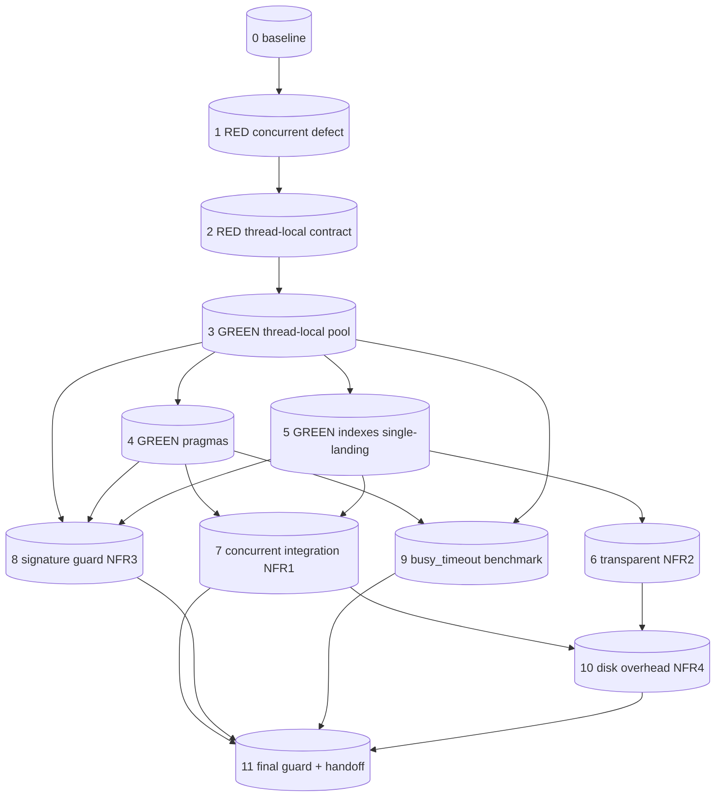

# Tasks: db-concurrency-hardening（W1 · DB 并发安全与数据层加固）

> 关联 spec：`docs/design-docs/PageIndex/db-concurrency-hardening/spec.md`（§1-8 已完成，已过 quality-gate）
> 设计方案：**B — 线程本地连接池（`threading.local`）+ WAL + `synchronous=NORMAL` + `busy_timeout=5000ms` + `foreign_keys=ON`**
> 纪律：TDD/L2（先 RED 失败测试，肉眼确认失败，再 GREEN）、Two-Agent（执行≠验证，NEEDS_INDEPENDENT_VERIFICATION，不自审）
> 透明性约束（NFR3）：`PageIndexDB` 公开方法签名零变更；上层 `server.py`/`router.py`/`main.py`/`closet_index.py` 调用方式不变。
> 落点文件：`db.py`（唯一改动源码文件；测试新增 `tests/test_db_concurrency.py`）

## 设计已定（不重复决策）

- **连接模型**：`threading.local()` 存储 per-thread 连接；`_connect()` 返回当前线程连接；`check_same_thread=False`（thread-local 保证单线程使用，仅消除 sqlite3 默认线程检查误报）。
- **Pragma（每连接，幂等）**：`journal_mode=WAL`、`synchronous=NORMAL`、`busy_timeout=5000`、`foreign_keys=ON`、`row_factory=Row`。
- **索引**（quality-gate 改进 #1）：3 条 `CREATE INDEX IF NOT EXISTS` **并入 `ensure_schema()` 的 `executescript`**（与现有 `idx_closet_tags_token`/`idx_doc_keywords` 并列，单一落点）；**禁止**新增 `_ensure_indexes(conn)` 在 thread-local 连接首次创建时重复执行（避免 `__init__`→`ensure_schema` 与 thread-local `_ensure_indexes` 双重执行）。
- **连接生命周期**：`_tls_connections` 登记所有 thread-local 连接 + `_tls_lock` 保护；`close()` 遍历关闭所有已登记连接。
- **公开方法签名不变**（NFR3）：`__init__`、`ensure_schema`、`close`、所有 insert/get/update/delete 方法签名保持。

## 基线（执行前先捕获，安全网）

- 命令：`.venv/bin/python -m pytest -q tests/test_db.py tests/test_super_tree.py tests/test_client_integration.py`
- 预期：全绿（W1 改动后必须保持 ≥ 基线通过数，无新增失败）。
- 若存在既有失败用例，列出清单告知用户（W1 只承诺"不引入新失败"）。

## Task List

### T0 — 基线（最先，阻塞性）

- [ ] 0. `test:` 建立 GREEN 基线（安全网）
  - 目标：捕获 `db.py` / `super_tree` / `client_integration` 测试当前通过数，作为 W1 改动的回归基线。
  - 实现步骤：
    1. 运行 `.venv/bin/python -m pytest -q tests/test_db.py tests/test_super_tree.py tests/test_client_integration.py`
    2. 将通过数/失败数记录到本文件"Status Record"
    3. 若有既有失败，列清单告知用户（不阻塞，但记录）
  - 验收（命令 + 期望输出）：`pytest -q tests/test_db.py tests/test_super_tree.py tests/test_client_integration.py` → 记录 `N passed / M failed`；若有失败，清单写入 Status Record
  - Dependencies: -
  - Risk: low

### T1 — RED：并发上传+搜索缺陷复现（证明 P0-1 根因）

- [ ] 1. `test:` 先写失败测试 —— 并发上传+搜索在当前 `db.py` 下崩溃/损坏（RED）
  - 目标：用集成测试**证实当前缺陷存在**（Iron Law L2：先 RED，肉眼确认失败）。
  - RED 测试描述（`tests/test_db_concurrency.py`，新增文件）：
    - `test_concurrent_upload_and_search_no_crash`：`ThreadPoolExecutor(max_workers=3)` 并发对同一 `PageIndexDB` 实例执行 3 个不同文件的 `insert_document` + `insert_nodes` + `insert_pages`，同时另一线程并发执行 `get_all_documents` / `get_nodes_by_doc_id`（模拟 `_run_strategies` 读路径）。断言：全部任务无异常抛出 + db 一致性（`PRAGMA foreign_key_check` 无违反 + documents/nodes/pages 行数符合预期）。
  - 预期 RED 输出（肉眼确认失败）：当前 `db.py` 单连接跨线程共享 → 抛 `sqlite3.ProgrammingError: SQLite objects created in a thread can only be used in that same thread` 或并发交错导致状态损坏（行数不符 / `foreign_key_check` 违反）。**必须肉眼看到失败**，证明根因，再进入 T2 实现。
  - 实现步骤：
    1. 新建 `tests/test_db_concurrency.py`
    2. 写 `test_concurrent_upload_and_search_no_crash`（用临时 `tmp_path` db，3 线程写 + 1 线程读，gather 后一致性断言）
    3. 运行 `pytest -q tests/test_db_concurrency.py::test_concurrent_upload_and_search_no_crash`
    4. **肉眼确认失败**（记录失败类型到 Status Record）
  - 验收（命令 + 期望输出）：
    ```
    pytest -q tests/test_db_concurrency.py::test_concurrent_upload_and_search_no_crash
    → FAILED（ProgrammingError 或一致性断言失败）
    ```
  - Dependencies: 0
  - Risk: medium（需稳定复现并发缺陷；若偶发不可复现，加大并发度或循环次数）

### T2 — RED：线程本地连接复用与清理测试（为 T3 实现锁定行为契约）

- [ ] 2. `test:` 先写失败测试 —— thread-local 连接复用 + 清理契约（RED）
  - 目标：锁定 T3 实现必须满足的行为契约（连接复用、跨线程隔离、close 清理全部连接）。
  - RED 测试描述（`tests/test_db_concurrency.py`，追加）：
    - `test_same_thread_reuses_connection`：同一线程两次 `_connect()` 返回**同一连接对象**（`is` 相等）—— 锁定"复用而非每次新建"。
    - `test_different_threads_get_different_connections`：两个不同线程各自 `_connect()` 返回**不同连接对象**（`is not` 相等）—— 锁定"线程隔离"。
    - `test_close_closes_all_thread_local_connections`：`ThreadPoolExecutor(max_workers=3)` 各线程 `_connect()` 后，主线程 `db.close()` → 断言 `_tls_connections` 中所有连接已 close（`conn._closed` 或尝试 execute 报 `ProgrammingError: Cannot operate on a closed database`）—— 锁定 R1/R3 连接清理。
  - 预期 RED 输出：当前 `db.py` 无 `_tls_connections` 属性 / `_connect()` 返回单例 → `test_different_threads_get_different_connections` 失败（两线程拿到同一连接）+ `test_close_closes_all_thread_local_connections` 失败（`AttributeError: _tls_connections`）。
  - 实现步骤：
    1. 在 `tests/test_db_concurrency.py` 追加 3 个测试
    2. 运行 `pytest -q tests/test_db_concurrency.py -k "reuses or different_threads or closes_all"`
    3. 肉眼确认失败
  - 验收（命令 + 期望输出）：
    ```
    pytest -q tests/test_db_concurrency.py -k "reuses or different_threads or closes_all"
    → FAILED（AttributeError _tls_connections / 同一连接 is 相等）
    ```
  - Dependencies: 1
  - Risk: low

### T3 — GREEN：`_connect()` 改造为 thread-local 连接池（FR1）

- [ ] 3. `feat:` `db.py` 改造 `_connect()`/`__init__`/`close()` 为 thread-local 连接池
  - 目标：实现方案 B 连接模型，消除"跨线程共享单连接"根因（FR1）。
  - 实现步骤（`db.py`，仅此文件）：
    1. `__init__`：`self._conn = None` → `self._local = threading.local()` + `self._tls_connections = []` + `self._tls_lock = threading.Lock()`；保留 `self.ensure_schema()` 调用。
    2. `_connect()`：
       - `conn = getattr(self._local, "conn", None)`
       - `if conn is None:` → `sqlite3.connect(self.db_path, check_same_thread=False)` → 设 5 个 pragma（`journal_mode=WAL`/`synchronous=NORMAL`/`busy_timeout=5000`/`foreign_keys=ON`）+ `row_factory=sqlite3.Row` → `self._local.conn = conn` → `with self._tls_lock: self._tls_connections.append(conn)`
       - `return conn`
    3. `close()`：关闭当前线程 `_local.conn`（若有）+ `with self._tls_lock:` 遍历 `_tls_connections` 逐个 `close()`（try/except 吞已关闭），最后 `clear()`。
    4. **注意**：`ensure_schema()` 内 `with self._connect() as conn:` 已用上下文管理器；thread-local 连接的 `__enter__`/`__exit__` 是 sqlite3 连接原生事务语义（提交/回滚），改造后仍成立——保持现有 `with self._connect() as conn:` 调用方式不变（透明，NFR3）。
  - 验收（命令 + 期望输出）：
    ```
    # T1 RED 转部分 GREEN（崩溃消除，但 pragma/索引测试可能仍未过——后续 T4/T5 补全）
    pytest -q tests/test_db_concurrency.py::test_concurrent_upload_and_search_no_crash
    → PASSED（无 ProgrammingError，一致性断言通过）
    pytest -q tests/test_db_concurrency.py -k "reuses or different_threads or closes_all"
    → PASSED
    ```
  - Dependencies: 2
  - Risk: medium（thread-local 生命周期管理；`close()` 遍历需线程安全）

### T4 — GREEN：WAL + pragma 全部生效（FR2）

- [ ] 4. `test:` 先写 pragma 断言测试（RED，若 T3 已设 pragma 则直接 GREEN）
  - 目标：锁定 FR2 —— `journal_mode=wal`、`synchronous=1(NORMAL)`、`busy_timeout=5000`。
  - RED 测试描述（`tests/test_db_concurrency.py`，追加）：
    - `test_pragmas_set_correctly`：新建 `PageIndexDB(tmp)` → `_connect()` → 断言 `PRAGMA journal_mode` == `wal`、`PRAGMA synchronous` == `1`、`PRAGMA busy_timeout` == `5000`、`PRAGMA foreign_keys` == `1`。
  - 实现步骤：
    1. 追加 `test_pragmas_set_correctly`
    2. 运行 `pytest -q tests/test_db_concurrency.py::test_pragmas_set_correctly`
    3. 若 T3 已在 `_connect()` 设 pragma → 直接 GREEN；若遗漏 → RED，补全 pragma 后 GREEN
  - 验收（命令 + 期望输出）：
    ```
    pytest -q tests/test_db_concurrency.py::test_pragmas_set_correctly
    → PASSED
    # 守卫（spec §8.4）
    python -c "from db import PageIndexDB; import tempfile,os; d=PageIndexDB(os.path.join(tempfile.mkdtemp(),'t.db')); c=d._connect(); print(c.execute('PRAGMA journal_mode').fetchone()[0], c.execute('PRAGMA synchronous').fetchone()[0], c.execute('PRAGMA busy_timeout').fetchone()[0])"
    → wal 1 5000
    ```
  - Dependencies: 3
  - Risk: low

### T5 — GREEN：索引创建并入 `ensure_schema` 单一落点（FR3 + quality-gate 改进 #1）

- [ ] 5. `test:` 先写索引存在测试（RED）→ `feat:` 索引 DDL 并入 `ensure_schema` executescript（GREEN）
  - 目标：FR3 —— 3 索引存在；quality-gate 改进 #1 —— 索引 DDL **并入 `ensure_schema()` 的 `executescript`**，禁止新增 `_ensure_indexes(conn)` 双重落点。
  - RED 测试描述（`tests/test_db_concurrency.py`，追加）：
    - `test_indexes_exist`：新建 `PageIndexDB(tmp)` → `SELECT name FROM sqlite_master WHERE type='index' AND name LIKE 'idx_%'` → 断言含 `idx_nodes_doc_id`、`idx_nodes_parent_node_id`、`idx_pages_doc_id`（+ 现有 `idx_closet_tags_token`、`idx_doc_keywords`）。
    - `test_indexes_created_via_ensure_schema_single_landing`（守卫 quality-gate 改进 #1）：`grep -nE "_ensure_indexes" db.py` → **为空**（禁止新增 `_ensure_indexes` 方法）；`grep -nE "CREATE INDEX IF NOT EXISTS idx_nodes_doc_id" db.py` → 命中在 `ensure_schema` 的 `executescript` 字符串内。
  - 实现步骤（`db.py`，仅 `ensure_schema` 的 `executescript` 字符串）：
    1. 在 `executescript` 内，现有 `idx_closet_tags_token`（db.py:68-69）与 `idx_doc_keywords`（db.py:77）之后，追加：
       ```sql
       CREATE INDEX IF NOT EXISTS idx_nodes_doc_id
           ON nodes(doc_id);

       CREATE INDEX IF NOT EXISTS idx_nodes_parent_node_id
           ON nodes(parent_node_id);

       CREATE INDEX IF NOT EXISTS idx_pages_doc_id
           ON pages(doc_id);
       ```
    2. **禁止**新增 `_ensure_indexes(conn)` 方法或在 `_connect()` 内调用索引创建（避免 `__init__`→`ensure_schema` 与 thread-local `_ensure_indexes` 重复执行）。
    3. 因 `executescript` 在 `__init__`→`ensure_schema` 首次建表时即执行，且 `CREATE INDEX IF NOT EXISTS` 幂等，每个新 thread-local 连接首次 `_connect()` 时**不需要**再建索引（索引是 db 级持久化对象，非连接级）——这也正是并入 `ensure_schema` 单一落点的理由。
  - 验收（命令 + 期望输出）：
    ```
    pytest -q tests/test_db_concurrency.py::test_indexes_exist
    → PASSED
    pytest -q tests/test_db_concurrency.py::test_indexes_created_via_ensure_schema_single_landing
    → PASSED
    # 守卫（spec §8.4）
    grep -nE "_ensure_indexes" db.py
    → (空)
    grep -nE "CREATE INDEX IF NOT EXISTS idx_nodes_doc_id" db.py
    → 命中（在 ensure_schema executescript 内）
    ```
  - Dependencies: 3
  - Risk: low（DDL 幂等，附加式）

### T6 — GREEN：索引对现有数据透明（NFR2）

- [ ] 6. `test:` 先写透明性测试（RED）→ 验证现有数据 + 新建实例后索引自动创建且数据不丢（GREEN）
  - 目标：NFR2 —— 对已有数据的 `pageindex.db` 打开，索引自动创建（`IF NOT EXISTS`），无数据丢失。
  - RED 测试描述（`tests/test_db_concurrency.py`，追加）：
    - `test_indexes_transparent_to_existing_data`：预置数据（插入 1 document + 2 nodes + 2 pages）→ 新建另一 `PageIndexDB` 实例指向同一 db 文件 → 断言 3 索引存在 + documents/nodes/pages 行数不变（1/2/2）。
  - 实现步骤：
    1. 追加 `test_indexes_transparent_to_existing_data`
    2. 运行 → 若 T5 已实现则直接 GREEN；若 RED 则检查 `ensure_schema` 是否在新建实例时执行（`__init__` 调 `ensure_schema`）
  - 验收（命令 + 期望输出）：
    ```
    pytest -q tests/test_db_concurrency.py::test_indexes_transparent_to_existing_data
    → PASSED
    ```
  - Dependencies: 5
  - Risk: low

### T7 — GREEN：并发集成测试完整通过（NFR1）

- [ ] 7. `test:` 并发上传 + 并发搜索集成测试全绿 + 一致性校验（NFR1）
  - 目标：NFR1 —— 并发上传 ≥3 文件 + 并发搜索不崩溃、不损坏；`PRAGMA foreign_key_check` 无违反。
  - 测试描述（`tests/test_db_concurrency.py`，完善 T1 的测试 + 追加）：
    - 扩展 `test_concurrent_upload_and_search_no_crash`：显式 `max_workers=3` 并验证 3 线程并发执行；并发度参数 ≥3（对齐 `Semaphore(3)`）。
    - 新增 `test_concurrent_upload_foreign_key_integrity`：3 并发上传后 `PRAGMA foreign_key_check` 返回空列表。
    - 新增 `test_concurrent_upload_and_search_data_consistency`：3 并发上传不同文件 + 并发 `get_all_documents`/`get_nodes_by_doc_id` → 断言每个 doc 的 nodes/pages 行数与插入数一致。
  - 实现步骤：
    1. 完善/追加上述测试
    2. 运行 `pytest -q tests/test_db_concurrency.py -k "concurrent_upload_and_search or concurrent_upload_foreign or concurrent_upload_and_search_data"`
  - 验收（命令 + 期望输出）：
    ```
    pytest -q tests/test_db_concurrency.py -k "concurrent_upload_and_search or concurrent_upload_foreign or concurrent_upload_and_search_data"
    → PASSED（全部通过，无 ProgrammingError，foreign_key_check 空）
    ```
  - Dependencies: 3, 4, 5
  - Risk: medium（并发测试需稳定；必要时加循环次数提高缺陷检出率）

### T8 — GREEN：公开方法签名不变守卫（NFR3）

- [ ] 8. `verify:` 静态检查 `PageIndexDB` 公开方法签名 diff 为空 + 上层调用点无改动
  - 目标：NFR3 —— `PageIndexDB` 公开方法签名零变更；上层 `server.py`/`router.py`/`main.py`/`closet_index.py` 调用方式不变。
  - 实现步骤：
    1. `git diff --stat db.py` → 仅 `db.py` 改动
    2. `git diff server.py router.py main.py pageindex_mutil/closet_index.py pageindex_mutil/super_tree.py pageindex_mutil/client.py` → 空（或仅 import 无关项）
    3. 验证 `closet_index.py:152` `with self.db._connect() as conn:` 仍可工作（`_connect` 签名不变，返回 thread-local 连接，透明）
  - 验收（命令 + 期望输出）：
    ```
    git diff --stat db.py
    → db.py | N +-
    git diff --stat server.py router.py main.py pageindex_mutil/closet_index.py pageindex_mutil/super_tree.py pageindex_mutil/client.py
    → (空)
    ```
  - Dependencies: 3, 4, 5
  - Risk: low

### T9 — 实测写入延迟基准 + busy_timeout 验证（quality-gate 改进 #2）

- [ ] 9. `test:` 实测写入延迟基准，验证 `busy_timeout=5000ms` ≥ 3 倍单次写时延（若不满足则上调并文档化）
  - 目标：quality-gate 改进 #2 —— 实测单次写时延，验证 `busy_timeout=5000ms` 覆盖 3 并发上传排队深度（≥ 3× 单次写时延）；若不满足则上调 `busy_timeout` 并在本文件 + spec §6.1 文档化。
  - RED 测试描述（`tests/test_db_concurrency.py`，追加）：
    - `test_busy_timeout_covers_3x_write_latency`：测单次 `insert_document`+`insert_nodes`（N 节点）+`insert_pages`（M 页）的写时延 `t_write`（取 10 次中位数）→ 断言 `5000 >= 3 * t_write`。若断言失败 → 测试输出 `t_write` 与建议 `busy_timeout` 值，**任务标记为需调整**。
  - 实现步骤：
    1. 追加 `test_busy_timeout_covers_3x_write_latency`（用 `time.perf_counter` 测，插入典型文档：1 doc + ~50 nodes + ~20 pages）
    2. 运行 → 记录 `t_write` 中位数与 `3 * t_write`
    3. **判定**：
       - 若 `5000 >= 3 * t_write` → GREEN，记录基准到 Status Record（如 `t_write=120ms, 3x=360ms < 5000ms ✓`）
       - 若 `5000 < 3 * t_write` → RED，上调 `busy_timeout`（如 `10000`），同步修改 T3/T4 的 pragma 值 + spec §6.1 + 本文件"设计已定"段落，重跑至 GREEN
  - 验收（命令 + 期望输出）：
    ```
    pytest -q tests/test_db_concurrency.py::test_busy_timeout_covers_3x_write_latency -s
    → PASSED（输出 t_write 中位数 + 3x + busy_timeout 对比）
    # Status Record 记录：t_write=<X>ms, 3*<X>=<Y>ms, busy_timeout=5000ms, 判定=PASS/ADJUSTED
    ```
  - Dependencies: 3, 4
  - Risk: medium（写时延受机器负载影响；取中位数 + 多次采样降低噪声；若需上调 busy_timeout 则波及 T3/T4/spec）

### T10 — GREEN：磁盘开销量化（NFR4）

- [ ] 10. `test:` WAL + 索引磁盘开销 ≤ 现有 db 体积 1.5 倍（NFR4）
  - 目标：NFR4 —— WAL 文件 + 3 索引合计磁盘开销 ≤ 现有 `pageindex.db` 体积的 1.5 倍（spec §7.1 阈值）。
  - RED 测试描述（`tests/test_db_concurrency.py`，追加）：
    - `test_disk_overhead_within_threshold`：插入 N 文档（N=5，每文档 ~50 nodes + ~20 pages）→ checkpoint（`PRAGMA wal_checkpoint(TRUNCATE)`）→ 测 `pageindex.db` + `pageindex.db-wal` + `pageindex.db-shm` 总体积 `total` 与纯 db 体积 `db_only` → 断言 `total <= 1.5 * db_only`。
  - 实现步骤：
    1. 追加 `test_disk_overhead_within_threshold`
    2. 运行 → 记录 `db_only` / `total` / 比值到 Status Record
    3. 若超阈值 → 分析原因（索引体积过大？WAL 未 checkpoint？），必要时调整阈值（需用户确认，更新 spec §7.1）
  - 验收（命令 + 期望输出）：
    ```
    pytest -q tests/test_db_concurrency.py::test_disk_overhead_within_threshold -s
    → PASSED（输出 db_only / total / ratio，ratio <= 1.5）
    # Status Record 记录：db_only=<X>KB, total=<Y>KB, ratio=<Y/X>
    ```
  - Dependencies: 5, 7
  - Risk: low（典型文档索引体积 < 3MB，WAL auto-checkpoint 有界；阈值 1.5× 宽裕）

### T11 — 最终守卫：全量回归 + 独立验证 handoff

- [ ] 11. `verify:` 全量测试回归 + handoff.md（NEEDS_INDEPENDENT_VERIFICATION）
  - 目标：W1 全部任务完成，产出 handoff 交独立 verifier 跑 §8 守卫（Two-Agent，不自审）。
  - 实现步骤：
    1. 运行全量回归：`.venv/bin/python -m pytest -q tests/test_db.py tests/test_super_tree.py tests/test_client_integration.py tests/test_db_concurrency.py`
    2. 运行 spec §8.4 全部守卫命令（pragma / 索引 / 并发集成）
    3. 写 handoff.md（Producer=leaf-executor，Status=NEEDS_INDEPENDENT_VERIFICATION，Self-review=NOT PERFORMED）
    4. **禁止自评**——交独立 verifier 子代理调用 `Skill("devkit:code-verification")` + `Skill("devkit:quality-gate")`
  - 验收（命令 + 期望输出）：
    ```
    pytest -q tests/test_db.py tests/test_super_tree.py tests/test_client_integration.py tests/test_db_concurrency.py
    → N passed / 0 failed（N >= T0 基线 + 新增测试数）
    # spec §8.4 守卫
    python -c "from db import PageIndexDB; import tempfile,os; d=PageIndexDB(os.path.join(tempfile.mkdtemp(),'t.db')); c=d._connect(); print(c.execute('PRAGMA journal_mode').fetchone()[0], c.execute('PRAGMA synchronous').fetchone()[0], c.execute('PRAGMA busy_timeout').fetchone()[0])"
    → wal 1 5000
    python -c "import sqlite3,os,tempfile; from db import PageIndexDB; p=os.path.join(tempfile.mkdtemp(),'t.db'); PageIndexDB(p); c=sqlite3.connect(p); print(sorted(r[0] for r in c.execute(\"SELECT name FROM sqlite_master WHERE type='index' AND name LIKE 'idx_%'\").fetchall()))"
    → ['idx_closet_tags_token', 'idx_doc_keywords', 'idx_nodes_doc_id', 'idx_nodes_parent_node_id', 'idx_pages_doc_id']
    ```
  - Dependencies: 7, 8, 9, 10
  - Risk: low

## Coverage Matrix（spec §3 FR/NFR ↔ Task）

| Spec 项 | 描述 | 覆盖 Task |
|---------|------|-----------|
| **FR1** | 多线程 `asyncio.to_thread` 安全（无 ProgrammingError/损坏） | T1(RED 证缺陷) → T3(GREEN thread-local) → T7(并发集成) |
| **FR2** | `journal_mode=WAL` + `synchronous=NORMAL` + `busy_timeout` | T3(实现) → T4(pragma 断言) → T9(busy_timeout 基准) |
| **FR3** | 3 索引存在（`idx_nodes_doc_id`/`idx_nodes_parent_node_id`/`idx_pages_doc_id`） | T5(并入 ensure_schema 单一落点) |
| **NFR1** | 并发上传 + 并发搜索集成测试通过，无崩溃/损坏 | T1 → T7 |
| **NFR2** | 索引对现有数据透明（`CREATE INDEX IF NOT EXISTS`） | T5 + T6 |
| **NFR3** | `PageIndexDB` 公开方法签名不变 | T8（静态 diff 守卫） |
| **NFR4** | WAL + 索引磁盘开销 ≤ 1.5× | T10 |
| §8.3 连接清理 | N 线程连接 → close 全部关闭 | T2(RED) → T3(GREEN) |
| §8.3 线程复用 | 同线程复用同一连接 | T2(RED) → T3(GREEN) |

## Execution Order



## 关键路径 / 高风险

- **关键路径**：0 → 1 → 2 → 3 → 7 → 11（RED 证缺陷 → thread-local 实现 → 并发集成 → 最终守卫）
- **高风险任务**：
  - **T1**（并发缺陷复现）—— 需稳定复现 `ProgrammingError`；若偶发，加大并发度/循环次数。
  - **T3**（thread-local 改造）—— 连接生命周期管理 + `close()` 遍历线程安全；`closet_index.py:152` `with self.db._connect() as conn:` 透明性需验证。
  - **T9**（busy_timeout 基准）—— 若实测写时延偏高导致 `5000 < 3×t_write`，需上调 `busy_timeout` 并波及 T3/T4/spec §6.1（已预案）。
- **TDD 结构**：T1/T2 先 RED（肉眼确认失败）→ T3 GREEN → T4/T5/T6/T7 逐条 GREEN → T8 静态守卫 → T9 基准 → T10 磁盘 → T11 最终守卫。

## 依赖标注（W1 → W2）

> **W1 是 W2 的前置**。W2（`delete_document` 并发安全实现）依赖 W1 落地的线程本地连接层 + WAL + 索引：
> - W2 的 `delete_document` 将在多线程 `asyncio.to_thread` 下执行 `DELETE FROM documents WHERE id=?`（`ON DELETE CASCADE` 级联删 `nodes`/`pages`/`closet_tags`/`doc_keywords`），依赖 W1 的 thread-local 连接保证并发安全（无 ProgrammingError）。
> - W2 的级联删除依赖 `idx_nodes_doc_id`/`idx_pages_doc_id` 加速 `DELETE FROM nodes WHERE doc_id=?`（W1 T5 提供）。
> - W2 的写操作依赖 W1 的 `busy_timeout=5000ms`（W1 T9 验证）覆盖并发删除排队。
> - **W2 须在 W1 T11 最终守卫通过、独立 verifier 确认后才启动。**

## Execution Mode

- **subagent-driven**（推荐）：code 阶段每批 task 由 leaf-executor 子代理执行 → 产出 handoff.md（NEEDS_INDEPENDENT_VERIFICATION）→ 不同 verifier 子代理独立跑守卫 → quality-gate。
- TDD/L2 强制：T1/T2 必须**先写失败测试并肉眼确认失败输出**后才能进入 T3 实现。
- Two-Agent 强制：T11 最终守卫由独立 verifier 子代理执行（producer ≠ verifier，不自审）。

## Status Record

| Task | Status | Start | End | Notes |
|------|--------|-------|-----|-------|
| 0 | DONE | 2026-06-23 | 2026-06-23 | baseline: `uv run pytest -q` → 55 passed, 0 failed |
| 1 | DONE | 2026-06-23 | 2026-06-23 | RED confirmed: `sqlite3.ProgrammingError: SQLite objects created in a thread can only be used in that same thread` |
| 2 | DONE | 2026-06-23 | 2026-06-23 | RED confirmed: `AssertionError: different threads must get different connections` + `AttributeError: _tls_connections` (test_same_thread_reuses_connection passed on RED — reuse already true) |
| 3 | DONE | 2026-06-23 | 2026-06-23 | GREEN: thread-local pool via threading.local + _tls_connections + _tls_lock; 4 tests pass |
| 4 | DONE | 2026-06-23 | 2026-06-23 | GREEN: pragmas verified — `wal 1 5000` (+ foreign_keys=1); per-thread conn also verified |
| 5 | DONE | 2026-06-23 | 2026-06-23 | GREEN: 3 indexes added to ensure_schema executescript; grep `_ensure_indexes` empty ✓; 5 indexes present |
| 6 | DONE | 2026-06-23 | 2026-06-23 | GREEN: reopen existing db auto-creates indexes, data intact (1 doc / 2 nodes / 2 pages) |
| 7 | DONE | 2026-06-23 | 2026-06-23 | GREEN: 3 concurrent tests pass (no crash, foreign_key_check empty, data consistency) |
| 8 | DONE | 2026-06-23 | 2026-06-23 | NFR3: only `db.py` changed (73+/8-); upper-layer files 0 diff; `with self.db._connect() as conn:` transparency preserved (commit after ctx exit verified) |
| 9 | DONE | 2026-06-23 | 2026-06-23 | t_write_median=0.51ms, 3x=1.53ms, busy_timeout=5000ms → PASS (no adjustment needed) |
| 10 | DONE | 2026-06-23 | 2026-06-23 | db_only=76.0KB, wal=0.0KB(post-checkpoint), shm=0.0KB, ratio=1.000 ≤ 1.5 → PASS |
| 11 | DONE | 2026-06-23 | 2026-06-23 | Full suite `uv run pytest -q` → 68 passed, 0 failed (+13 new, 0 regressions); §8.4 guards all pass |
