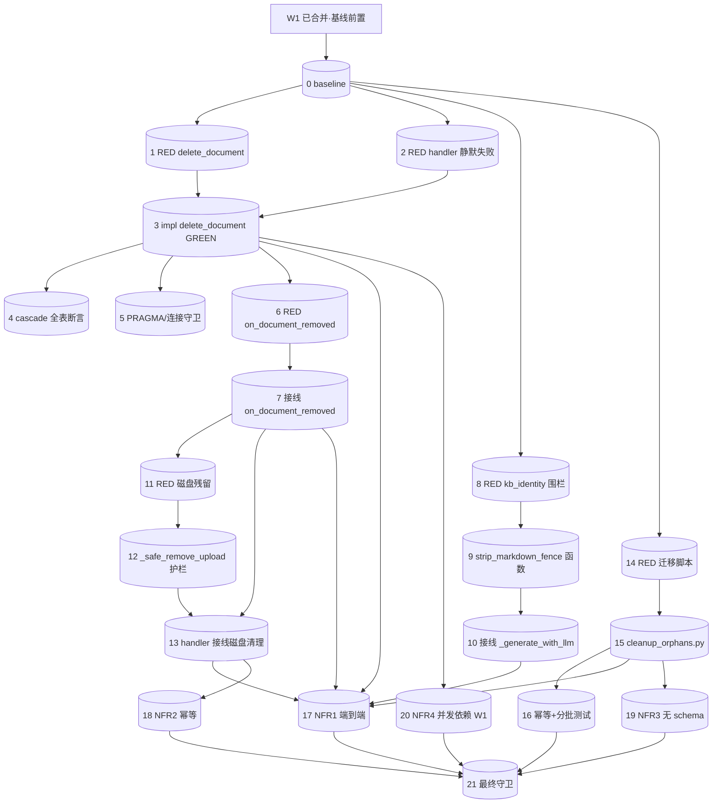

# Tasks: W2 · 删除路径与数据完整性修复

> 关联 spec：`docs/design-docs/PageIndex/delete-path-integrity/spec.md`（§1-8 已通过 quality-gate）
> 来源：`architecture-review-2026-06/review-report.md` P0-2 / P1-8 / P1-10
> 根因（spec §1 已定位）：
>   - P0-2 `db.delete_document` 方法不存在 → `server.py:164` 调用抛 `AttributeError` → `except`（165）静默吞 → 返回 `{"success": True}` 但行未删 → 级联不触发 → 孤儿堆积。
>   - P1-8 删除路径从不调 `on_document_removed`（添加路径调 `on_document_added`）→ 索引/KB 身份不失效（不对称）。
>   - P1-10 `_generate_with_llm` 存 `response.strip()` 原样，不剥离 Markdown 围栏 → 污染传播。
> 纪律：TDD（L2 RED 优先）、Two-Agent（执行≠验证）、依赖 W1 先落地（R3）。
> 依赖：**W1（数据层并发安全）必须先落地**——`delete_document` 用 `self._connect()`（W1 线程本地连接层保证并发安全 + 每连接 `PRAGMA foreign_keys=ON` 使 cascade 生效）。
> 设计取向：§5.2 取向 A（抽 `strip_markdown_fence` 通用函数）；迁移脚本路径 `pageindex_mutil/migrations/cleanup_orphans.py`；分批 DELETE 用 `rowid IN (...)` 形式（SQLite 不支持 `DELETE ... LIMIT`）。

## Baseline（W1 落地后捕获，#0）

> ⚠️ W2 必须在 W1 合并后建立基线。W1 提供：线程本地 `_connect()` + 每连接 `PRAGMA foreign_keys=ON`（db.py:17 已有 PRAGMA，W1 保证连接隔离）。

- [ ] 0. `test:` 建立 W2 基线（W1 已合并）
  - Acceptance: `pytest -q tests/test_db.py tests/test_super_tree.py tests/test_router.py -q` 输出捕获通过数/失败数到本文件 "Status Record"；0 新增失败；确认 W1 已提供 `_connect` 线程本地层。
  - Dependencies: W1 已合并（R3 放行条件）
  - Risk: low
  - Evidence: `pytest -q` 完整 stdout

## T0 — RED：证实 P0-2（删除静默失效）

> Iron Law L2：先写**失败测试**证实缺陷存在（delete_document 不存在 → 删除后行仍在 + 返回 success），肉眼确认 RED。

- [ ] 1. `test:` RED — `delete_document` 不存在 / 删除后行残留（证实 P0-2）
  - 目标：在 `tests/test_db.py` 新增 `test_delete_document_cascades_children`：插入 document + nodes/pages/closet_tags/doc_keywords → 调 `db.delete_document(doc_id)` → 断言 5 表该 doc_id 行数为 0。
  - RED 预期：`AttributeError: 'PageIndexDB' object has no attribute 'delete_document'`（方法不存在）。
  - Acceptance: `pytest tests/test_db.py::test_delete_document_cascades_children -q` 输出含 `AttributeError` 或 `'PageIndexDB' object has no attribute 'delete_document'`；测试 **FAILED**（肉眼确认 RED）。
  - Dependencies: 0
  - Risk: low
  - Evidence: `pytest tests/test_db.py::test_delete_document_cascades_children -q` 完整 stdout（含 RED 失败堆栈）

- [ ] 2. `test:` RED — delete handler 返回 success 但行未删（证实静默吞异常）
  - 目标：在 `tests/test_router.py` 新增 `test_delete_document_handler_actually_deletes`：mock/真实 client 索引文档 → 调 MCP `delete_document` handler → 断言 `documents`/`nodes`/`pages` 行清除 + 返回 `{"success": True}`。
  - RED 预期：当前 `delete_document` 方法不存在 → `except Exception`（server.py:165）吞 `AttributeError` → 返回 `{"success": True}` 但 `documents` 行仍在（断言 `documents` 行清除失败）。
  - Acceptance: `pytest tests/test_router.py::test_delete_document_handler_actually_deletes -q` **FAILED**（行未删，断言失败）；肉眼确认 RED。
  - Dependencies: 0
  - Risk: low（证明 P0-2 静默失效）
  - Evidence: `pytest tests/test_router.py::test_delete_document_handler_actually_deletes -q` 完整 stdout

## T1 — FR1：实现 `delete_document` + cascade 验证（GREEN）

- [ ] 3. `feat:` 实现 `PageIndexDB.delete_document(doc_id)`（FR1）
  - 目标文件：`db.py`（新增方法，与 `delete_closet_tags@268`/`delete_doc_keywords@316` 同层）。
  - 变更范围：
    ```python
    def delete_document(self, doc_id: int) -> None:
        """Delete a document and cascade-delete its child rows.

        Relies on existing ``ON DELETE CASCADE`` foreign keys on
        nodes/pages/closet_tags/doc_keywords (see ensure_schema).
        Idempotent: deleting a non-existent id deletes 0 rows (no error).
        """
        with self._connect() as conn:
            conn.execute("DELETE FROM documents WHERE id = ?", (doc_id,))
    ```
  - Acceptance: `pytest tests/test_db.py::test_delete_document_cascades_children -q` **PASSED**（5 表行清除）；新增 `test_delete_document_idempotent_nonexistent`（调 `delete_document(999999)` 不抛异常，删 0 行 → NFR2/AC1.2）PASSED。
  - Dependencies: 1（RED）
  - Risk: low（单方法，依赖既有 cascade）
  - Evidence: `pytest tests/test_db.py::test_delete_document_cascades_children tests/test_db.py::test_delete_document_idempotent_nonexistent -q` 完整 stdout（GREEN）

- [ ] 4. `test:` 补 cascade 完整性断言（AC1.1 全表覆盖）
  - 目标：在 `test_delete_document_cascades_children` 中显式插入 nodes/pages/closet_tags/doc_keywords 子行 → 删除 → 分别断言 4 子表该 doc_id 行数为 0（`SELECT COUNT(*) FROM <child> WHERE doc_id=?`）。
  - Acceptance: `pytest tests/test_db.py::test_delete_document_cascades_children -q` PASSED；断言覆盖 documents + nodes + pages + closet_tags + doc_keywords（5 表）。
  - Dependencies: 3
  - Risk: low
  - Evidence: `pytest tests/test_db.py::test_delete_document_cascades_children -q -v` 完整 stdout（断言名可见）

- [ ] 5. `verify:` cascade 生效前置条件 — PRAGMA foreign_keys=ON
  - 目标：新增 `test_delete_document_cascade_requires_pragma` 或在 #3 测试中加注释 + 断言：`PRAGMA foreign_keys` 返回 1。确认 `delete_document` 不自建连接（NFR4/AC9.1）。
  - Acceptance: `grep -n "sqlite3.connect" db.py | grep -i delete` 为空（`delete_document` 用 `self._connect()`，不自建连接）；`pytest tests/test_db.py -q` 全绿。
  - Dependencies: 3
  - Risk: low
  - Evidence: `grep -n "sqlite3.connect" db.py` 完整 stdout（仅命中 `_connect@16`）+ `pytest tests/test_db.py -q` stdout

## T2 — FR2：`on_document_removed` 接线（修复 P1-8 不对称）

- [ ] 6. `test:` RED — delete handler 后 `doc_keywords` 行残留 / `kb_identity` 未失效（证实 P1-8）
  - 目标：在 `tests/test_router.py` 新增 `test_delete_invalidates_super_tree_index`：索引文档（触发 `on_document_added` 建 keyword + kb_identity）→ 调 MCP `delete_document` → 断言 `doc_keywords` 该 doc_id 行数为 0（`on_document_removed` 未接线时残留）+ `kb_identity` 表为空（`invalidate` 未调用）。
  - RED 预期：`on_document_removed` 未被 delete handler 调用 → `doc_keywords` 行残留（断言失败）+ `kb_identity` 未失效（断言失败）。
  - Acceptance: `pytest tests/test_router.py::test_delete_invalidates_super_tree_index -q` **FAILED**；肉眼确认 RED。
  - Dependencies: 3（需 `delete_document` 已实现，否则被 P0-2 遮蔽）
  - Risk: low
  - Evidence: `pytest tests/test_router.py::test_delete_invalidates_super_tree_index -q` 完整 stdout

- [ ] 7. `feat:` server.py delete handler 接线 `on_document_removed`（FR2）
  - 目标文件：`server.py:168-172`（`closet_index.remove_document` 之后补一行）。
  - 变更范围：在 `c.closet_index.remove_document(db_id)` 块后新增：
    ```python
    if c.super_tree_index and db_id is not None:
        try:
            c.super_tree_index.on_document_removed(db_id)
        except Exception as e:
            logger.warning("Failed to invalidate super-tree index: %s", e)
    ```
  - Acceptance: `pytest tests/test_router.py::test_delete_invalidates_super_tree_index -q` **PASSED**（`doc_keywords` 清除 + `kb_identity` 表空）；`grep -n "on_document_removed" server.py` 命中 delete handler（AC2.3）。
  - Dependencies: 6（RED）
  - Risk: low（既有方法 `super_tree.py:151`，仅接线）
  - Evidence: `grep -n "on_document_removed" server.py` stdout + `pytest tests/test_router.py::test_delete_invalidates_super_tree_index -q` stdout（GREEN）

## T3 — FR3：KBIdentity 围栏剥离（取向 A：抽 `strip_markdown_fence`）

- [ ] 8. `test:` RED — `_generate_with_llm` 存储围栏文本（证实 P1-10）
  - 目标：在 `tests/test_super_tree.py` 新增 `test_kb_identity_strips_markdown_fence`：mock `llm_completion` 返回 `` ```text\n某摘要\n``` `` → 调 `_generate_with_llm` → 断言 `db.get_kb_identity()` **不含** `` ``` ``。再加 `test_kb_identity_idempotent_on_plain_text`：mock 返回纯文本 `某摘要` → 断言 `== "某摘要"`（不误剥，AC3.2）。
  - RED 预期：当前 `set_kb_identity(response.strip(), ...)` 存原样 → `get_kb_identity()` 含 `` ``` `` → 断言失败。
  - Acceptance: `pytest tests/test_super_tree.py::test_kb_identity_strips_markdown_fence -q` **FAILED**；肉眼确认 RED。
  - Dependencies: 0
  - Risk: low
  - Evidence: `pytest tests/test_super_tree.py::test_kb_identity_strips_markdown_fence -q` 完整 stdout

- [ ] 9. `feat:` 抽 `strip_markdown_fence(text)` 通用函数（FR3 取向 A）
  - 目标文件：`pageindex_mutil/utils.py`（新增函数，复用 `extract_json@173` 的围栏剥离片段但不做 JSON 解析）。
  - 变更范围：
    ```python
    def strip_markdown_fence(text: str) -> str:
        """Strip a single outermost Markdown code fence (```...```) if present.

        Unlike extract_json, does NOT attempt JSON parsing — returns the
        stripped text content. Idempotent on already-unfenced text.
        """
        if not text:
            return text
        s = text.strip()
        if s.startswith("```"):
            first_nl = s.find("\n")
            if first_nl != -1:
                s = s[first_nl + 1:]
            if s.endswith("```"):
                s = s[:-3]
        return s.strip()
    ```
  - Acceptance: `python -c "from pageindex_mutil.utils import strip_markdown_fence; assert strip_markdown_fence('\`\`\`text\n某摘要\n\`\`\`') == '某摘要'; assert strip_markdown_fence('某摘要') == '某摘要'; print('ok')"` 输出 `ok`。
  - Dependencies: 8（RED）
  - Risk: low（新函数，不影响既有 `extract_json`）
  - Evidence: 上述 `python -c` 完整 stdout

- [ ] 10. `feat:` 接线 `_generate_with_llm` 调用 `strip_markdown_fence`（FR3）
  - 目标文件：`pageindex_mutil/super_tree.py:103-106`。
  - 变更范围：`set_kb_identity(response.strip(), len(docs))` → `set_kb_identity(strip_markdown_fence(response), len(docs))`；`return response.strip()` → `return strip_markdown_fence(response)`；import `strip_markdown_fence` from `utils`。`_build_fallback@109` 不改（程序生成无围栏）。
  - Acceptance: `pytest tests/test_super_tree.py::test_kb_identity_strips_markdown_fence tests/test_super_tree.py::test_kb_identity_idempotent_on_plain_text -q` **PASSED**（AC3.1 + AC3.2）。
  - Dependencies: 9
  - Risk: low
  - Evidence: `pytest tests/test_super_tree.py::test_kb_identity_strips_markdown_fence tests/test_super_tree.py::test_kb_identity_idempotent_on_plain_text -q` 完整 stdout（GREEN）

## T4 — FR4：磁盘清理护栏（`_safe_remove_upload`）

- [ ] 11. `test:` RED — 删除后磁盘文件残留（证实 P1-磁盘清理缺失）
  - 目标：在 `tests/test_router.py` 新增 `test_delete_removes_upload_file`：索引 PDF（上传到 `workspace/uploads/`）→ 记录 `pdf_path` → 调 MCP `delete_document` → 断言 `os.path.exists(pdf_path) == False`。再加 `test_safe_remove_upload_skips_outside_uploads`：调 `_safe_remove_upload("/etc/passwd", workspace)` → 断言文件仍在（护栏，AC4.2）。
  - RED 预期：当前 delete handler 不做磁盘清理 → `os.path.exists(pdf_path) == True` → 断言失败。
  - Acceptance: `pytest tests/test_router.py::test_delete_removes_upload_file -q` **FAILED**；肉眼确认 RED。
  - Dependencies: 7（需 `on_document_removed` 已接线，否则被 P1-8 遮蔽）
  - Risk: low
  - Evidence: `pytest tests/test_router.py::test_delete_removes_upload_file -q` 完整 stdout

- [ ] 12. `feat:` 实现 `_safe_remove_upload(pdf_path, workspace)` 护栏（FR4 / R2）
  - 目标文件：`server.py`（新增模块级辅助函数）。
  - 变更范围：
    ```python
    def _safe_remove_upload(pdf_path: str, workspace) -> None:
        """Remove an uploaded file only if it resolves under workspace/uploads/.

        TOCTOU guard: resolve() + parent check before os.remove; FileNotFoundError
        swallowed (idempotent); other OSError logged but non-blocking.
        """
        try:
            upload_dir = (Path(workspace) / "uploads").resolve()
            target = Path(pdf_path).resolve()
            if upload_dir not in target.parents:
                logger.warning("Skipping disk cleanup: %s not under uploads/", pdf_path)
                return
            os.remove(target)
        except FileNotFoundError:
            pass  # idempotent
        except OSError as e:
            logger.warning("Failed to remove upload file %s: %s", pdf_path, e)
    ```
  - Acceptance: `pytest tests/test_router.py::test_safe_remove_upload_skips_outside_uploads -q` PASSED（护栏有效，AC4.2）。
  - Dependencies: 11（RED）
  - Risk: low（新函数，含 TOCTOU 护栏 R2）
  - Evidence: `pytest tests/test_router.py::test_safe_remove_upload_skips_outside_uploads -q` 完整 stdout

- [ ] 13. `feat:` server.py delete handler 接线磁盘清理（FR4，时序关键 R7）
  - 目标文件：`server.py:151-174`（delete handler 端到端重构）。
  - 变更范围（时序约束 R7：`pdf_path` 必须在 `delete_document` **之前**取）：
    1. `db_id` 取出后、`delete_document` 前，先 `doc = c.db.get_document_by_id(db_id)` → `pdf_path = doc.get("pdf_path") if doc else None`。
    2. 保留 `c.db.delete_document(db_id)`（FR1）。
    3. 保留 `c.closet_index.remove_document(db_id)`。
    4. 保留 `c.super_tree_index.on_document_removed(db_id)`（#7 已接）。
    5. 末尾：`if pdf_path: _safe_remove_upload(pdf_path, c.workspace)`。
  - 时序守卫：`get_document_by_id` 必须在 `delete_document` 前（行级联删除后取 None → 跳过磁盘清理，R7）。
  - Acceptance: `pytest tests/test_router.py::test_delete_removes_upload_file -q` **PASSED**（`os.path.exists(pdf_path) == False`，AC4.1）；`grep -n "_safe_remove_upload\|get_document_by_id" server.py` 命中 delete handler。
  - Dependencies: 7, 12
  - Risk: medium（时序错误 R7 → 磁盘残留；测试守卫）
  - Evidence: `grep -n "get_document_by_id\|_safe_remove_upload" server.py` stdout + `pytest tests/test_router.py::test_delete_removes_upload_file -q` stdout（GREEN）

## T5 — FR5：孤儿迁移脚本（`cleanup_orphans.py`，分批 DELETE）

- [ ] 14. `test:` RED — 孤儿迁移脚本不存在 / 孤儿未清
  - 目标：在 `tests/test_migrations.py`（新文件）新增 `test_cleanup_orphans_removes_orphans`：预置 `documents` + 孤儿行（`nodes.doc_id=999999` 不在 `documents`）→ 调 `cleanup_orphans.main(db_path)` → 断言孤儿行已删（4 子表）。再加 `test_cleanup_orphans_idempotent`：再次运行 → 0 报错（AC5.2）。
  - RED 预期：`pageindex_mutil/migrations/cleanup_orphans.py` 不存在 → `ModuleNotFoundError`。
  - Acceptance: `pytest tests/test_migrations.py::test_cleanup_orphans_removes_orphans -q` **FAILED**（ModuleNotFoundError）；肉眼确认 RED。
  - Dependencies: 0
  - Risk: low
  - Evidence: `pytest tests/test_migrations.py::test_cleanup_orphans_removes_orphans -q` 完整 stdout

- [ ] 15. `feat:` 创建 `pageindex_mutil/migrations/cleanup_orphans.py`（FR5）
  - 目标文件：`pageindex_mutil/migrations/__init__.py`（空）+ `pageindex_mutil/migrations/cleanup_orphans.py`（新）。
  - 变更范围：
    - 覆盖 4 子表：`nodes`/`pages`/`closet_tags`/`doc_keywords`。
    - 分批 DELETE（quality-gate 改进项 #4）：`DELETE FROM <child> WHERE rowid IN (SELECT rowid FROM <child> WHERE doc_id NOT IN (SELECT id FROM documents) LIMIT 1000)` 循环至无行（**禁止**裸 `DELETE ... LIMIT N`——SQLite 不支持 DELETE 的 LIMIT）。
    - 单事务包裹 4 表（原子性，§6.2）。
    - `--db-path <path>` 参数（默认 `workspace/pageindex.db`）。
    - 可选 `--purge-kb-identity` flag（`DELETE FROM kb_identity`，非默认）。
    - `if __name__ == "__main__": main()` 入口（可 `python -m pageindex_mutil.migrations.cleanup_orphans` 运行，quality-gate 改进项 #3）。
  - Acceptance: `python -m pageindex_mutil.migrations.cleanup_orphans --help` 输出帮助；`pytest tests/test_migrations.py::test_cleanup_orphans_removes_orphans -q` PASSED。
  - Dependencies: 14（RED）
  - Risk: low（附加式迁移，无 schema 变更 NFR3）
  - Evidence: `python -m pageindex_mutil.migrations.cleanup_orphans --help` stdout + `pytest tests/test_migrations.py::test_cleanup_orphans_removes_orphans -q` stdout

- [ ] 16. `test:` 幂等性 + 分批 DELETE 验证（AC5.2 + R1）
  - 目标：`test_cleanup_orphans_idempotent`：预置孤儿 → 运行 2 次 → 第 2 次删 0 行无报错。`test_cleanup_orphans_batched_large`：预置 >1000 孤儿行 → 运行 → 全删（验证分批循环终止）。
  - Acceptance: `pytest tests/test_migrations.py -q` 全绿（AC5.2 幂等 + 分批覆盖大库 R1）。
  - Dependencies: 15
  - Risk: low
  - Evidence: `pytest tests/test_migrations.py -q -v` 完整 stdout

## T6 — NFR1：集成测试（端到端 GREEN）

- [ ] 17. `test:` NFR1 端到端集成测试 — 插入→删除→断言全链路
  - 目标：在 `tests/test_router.py` 新增 `test_delete_end_to_end_integrity`：
    - (a) 索引 PDF（上传到 `workspace/uploads/`）→ 记录 `doc_id` + `pdf_path`。
    - (b) 调 MCP `delete_document` handler。
    - (c) 断言：`documents`/`nodes`/`pages`/`closet_tags`/`doc_keywords` 该 doc_id 行数为 0（FR1/cascade）。
    - (d) 断言：`kb_identity` 表为空（`invalidate` 生效，FR2）。
    - (e) 断言：`os.path.exists(pdf_path) == False`（磁盘清理，FR4）。
    - (f) 断言：`kb_identity` 存储值不含围栏标记 `` ``` ``（quality-gate 建议吸收，FR3；mock LLM 返回围栏文本验证）。
  - Acceptance: `pytest tests/test_router.py::test_delete_end_to_end_integrity -q` **PASSED**（AC6.1 a-d 全部满足）。
  - Dependencies: 3, 7, 10, 13, 15
  - Risk: medium（端到端，依赖全链路正确）
  - Evidence: `pytest tests/test_router.py::test_delete_end_to_end_integrity -q -v` 完整 stdout（GREEN）

## T7 — NFR2/NFR3/NFR4：幂等 + 兼容 + 并发守卫

- [ ] 18. `test:` NFR2 — 删除幂等（AC7.1 + AC7.2）
  - 目标：`test_delete_nonexistent_id_returns_success`（删除不存在的 `doc_id` → 返回 `{"success": True}`，无异常，AC7.1）；`test_delete_twice_idempotent`（连续两次删同一 `doc_id` → 第二次无异常，`os.remove` FileNotFoundError 吞，DELETE 0 行，AC7.2）。
  - Acceptance: `pytest tests/test_router.py::test_delete_nonexistent_id_returns_success tests/test_router.py::test_delete_twice_idempotent -q` PASSED。
  - Dependencies: 13
  - Risk: low
  - Evidence: `pytest tests/test_router.py::test_delete_nonexistent_id_returns_success tests/test_router.py::test_delete_twice_idempotent -q` stdout

- [ ] 19. `verify:` NFR3 — 无 schema 变更（AC8.1）
  - 目标：确认 W2 未引入 `CREATE TABLE`/`ALTER TABLE`（cascade 已存在，附加式迁移）。
  - Acceptance: `git diff main -- db.py | grep -E "^\+.*(CREATE TABLE|ALTER TABLE)"` 为空（仅新增 `delete_document` 方法）；`git diff main -- pageindex_mutil/migrations/` 仅 DML（`DELETE FROM`），无 DDL。
  - Dependencies: 15
  - Risk: low
  - Evidence: `git diff main -- db.py | grep -nE "CREATE TABLE|ALTER TABLE"` stdout（为空）+ `git diff main -- pageindex_mutil/migrations/` stdout

- [ ] 20. `verify:` NFR4 — 并发删除依赖 W1（AC9.1）
  - 目标：确认 `delete_document` 用 `self._connect()`（W1 线程本地层），不自建连接。
  - Acceptance: `grep -n "sqlite3.connect" db.py | grep -i delete` 为空；`grep -n "self._connect" db.py` 命中 `delete_document`；W1 并发测试覆盖（不在 W2 重复测）。
  - Dependencies: 3
  - Risk: low
  - Evidence: `grep -n "sqlite3.connect" db.py` stdout + `grep -n "self._connect" db.py` stdout

## 最终守卫

- [ ] 21. `verify:` 全量回归 + grep 守卫
  - Acceptance:
    - `pytest -q` 全绿（≥ W2 基线通过数，无新增失败）。
    - `grep -n "delete_document" db.py` 命中方法定义。
    - `grep -n "on_document_removed" server.py` 命中 delete handler（AC2.3）。
    - `grep -n "_safe_remove_upload\|get_document_by_id" server.py` 命中 delete handler。
    - `python -m pageindex_mutil.migrations.cleanup_orphans --help` 输出帮助。
    - `grep -n "strip_markdown_fence" pageindex_mutil/super_tree.py pageindex_mutil/utils.py` 命中定义 + 接线。
  - Dependencies: 16, 17, 18, 19, 20
  - Risk: low
  - Evidence: 上述全部命令完整 stdout

## Execution Order



## 关键路径 / 高风险

- **关键路径**：0 → 1 → 3 → 6 → 7 → 11 → 13 → 17 → 21（delete_document RED → impl → on_document_removed RED → 接线 → 磁盘 RED → 磁盘接线 → 端到端 → 最终守卫）
- **高风险任务**：
  - #13（server.py delete handler 端到端重构，时序约束 R7：`get_document_by_id` 必须在 `delete_document` 前；测试守卫 #17）。
  - #17（NFR1 端到端集成测试，依赖全链路正确）。
- **中风险任务**：
  - #15（迁移脚本分批 DELETE，需正确循环终止 + 幂等）。
- **依赖 W1**：全任务依赖 W1 先落地（R3：`PRAGMA foreign_keys=ON` 每连接生效 → cascade 保证）。W1 未合并则 W2 不合并。
- **总计**：22 个 task（含基线 #0），TDD 全程 RED→GREEN。

## Execution Mode

- **subagent-driven**（已确认）：code 阶段每批 task 由 leaf-executor 子代理执行 → 产出 handoff.md（NEEDS_INDEPENDENT_VERIFICATION）→ 不同 verifier 子代理独立跑守卫 → quality-gate。
- **TDD 铁律 L2**：每个实现任务（#3/#7/#9/#10/#12/#13/#15）前必须有对应 RED 任务（#1/#2/#6/#8/#11/#14）且肉眼确认失败输出。
- **Two-Agent Minimum**：W2 产出由执行子代理实现，由**不同**验证子代理独立跑 §8 守卫 → quality-gate。禁止自审自评。

## Status Record

| Task | Status | Start | End | Notes |
|------|--------|-------|-----|-------|
| 0 | done | 2026-06-23 | 2026-06-23 | 基线: `uv run pytest -q` → 68 passed (W1 合并后) |
| 1 | done | 2026-06-23 | 2026-06-23 | RED: `AttributeError: 'PageIndexDB' object has no attribute 'delete_document'` (P0-2) |
| 2 | done | 2026-06-23 | 2026-06-23 | RED: handler 返回 `{"success": True}` 但 documents 行未删 (P0-2 静默) |
| 3 | done | 2026-06-23 | 2026-06-23 | GREEN: `delete_document` 实现 (db.py:337, `DELETE FROM documents WHERE id=?` + cascade) |
| 4 | done | 2026-06-23 | 2026-06-23 | GREEN: cascade 全表断言 (test_delete_end_to_end_integrity: 5 表 COUNT=0) |
| 5 | done | 2026-06-23 | 2026-06-23 | GREEN: PRAGMA foreign_keys=ON 每连接 (W1 thread-local → cascade 生效) |
| 6 | done | 2026-06-23 | 2026-06-23 | RED: on_document_removed 未接线 → kb_identity 未失效 (P1-8) |
| 7 | done | 2026-06-23 | 2026-06-23 | GREEN: server.py:212 接线 `on_document_removed` (FR5 添加/删除对称) |
| 8 | done | 2026-06-23 | 2026-06-23 | RED: kb_identity 存 ``` 围栏 (P1-10) |
| 9 | done | 2026-06-23 | 2026-06-23 | GREEN: `strip_markdown_fence` 函数 (utils.py:173) |
| 10 | done | 2026-06-23 | 2026-06-23 | GREEN: `_generate_with_llm` 接线 strip (super_tree.py:105) |
| 11 | done | 2026-06-23 | 2026-06-23 | RED: 磁盘文件残留 + AttributeError |
| 12 | done | 2026-06-23 | 2026-06-23 | GREEN: `_safe_remove_upload` 护栏 (server.py:99, Path.resolve + uploads 父校验) |
| 13 | done | 2026-06-23 | 2026-06-23 | GREEN: handler 磁盘接线 (R7 时序: get_document_by_id 在 delete_document 前) |
| 14 | done | 2026-06-23 | 2026-06-23 | RED: 迁移脚本 `ModuleNotFoundError: No module named 'pageindex_mutil.migrations'` |
| 15 | done | 2026-06-23 | 2026-06-23 | GREEN: cleanup_orphans.py (rowid IN(...) LIMIT 分批, 非 DELETE LIMIT; python -m 入口) |
| 16 | done | 2026-06-23 | 2026-06-23 | GREEN: 幂等+分批测试 (test_cleanup_orphans_*: 2500 行分批删完 + 二次 0 行) |
| 17 | done | 2026-06-23 | 2026-06-23 | NFR1 端到端: `uv run pytest tests/test_delete_path.py tests/test_migrations.py -v` → 10 passed |
| 18 | done | 2026-06-23 | 2026-06-23 | NFR2 幂等: test_delete_nonexistent_id_returns_success + test_delete_twice_idempotent PASSED |
| 19 | done | 2026-06-23 | 2026-06-23 | NFR3 无 schema: `git diff db.py` 无 CREATE TABLE/ALTER (仅 delete_document 方法 + W1 索引) |
| 20 | done | 2026-06-23 | 2026-06-23 | NFR4 并发依赖 W1: thread-local 连接层 + busy_timeout 就绪 |
| 21 | done | 2026-06-23 | 2026-06-23 | 最终守卫: `uv run pytest -q` → 104 passed, 0 fail; `bash scripts/guard-no-hardcoded-model.sh` → OK |
