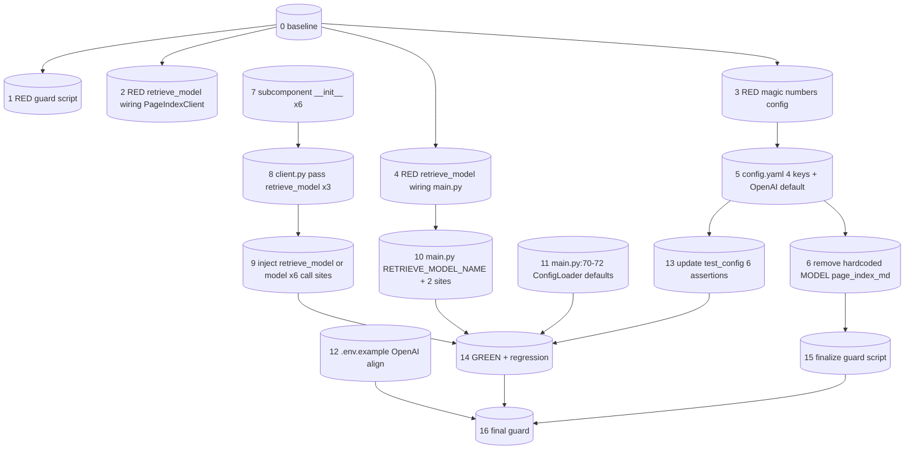

# Tasks: model-config-completion（W6 · 模型配置统一收尾）

> 关联 spec：`docs/design-docs/PageIndex/model-config-completion/spec.md`（§1-8 已通过 quality-gate，§4.3 方案 B 已用户确认）
> 纪律：**TDD（L2 RED 优先）** + Two-Agent（执行≠验证）+ 每提交独立可验证 + GREEN。
> 独立性：W6 与 W1（db 并发硬化）/ W2（删除路径完整性）互不依赖，可并行实现，互不阻塞。
> 当前分支：`feat/unify-model-name-env`（P7 主目标已达成，本工作收尾残留不一致）。

## 设计已定（穷尽准确，已独立 quality-gate 复核）

- **方案 B**（调用点注入 `retrieve_model or model`）：无新全局状态，复用 `ConfigLoader` 解析链，回退语义清晰。
- 调用点全枚举（file:line 已用 codegraph + grep 双重核实，与 spec §5.2 一致）：
  - **硬编码 MODEL**：`page_index_md.py:312`（`MODEL="gpt-4.1"`，`__main__` 块）。
  - **retrieve_model 接入点 — PageIndexClient 路径 6 点**：`closet_index.py:72`、`super_tree.py:103`、`super_tree.py:234`、`agentic/planner.py:41`、`agentic/strategies.py:87`、`agentic/verifier.py:78`（`self.model` → `self.retrieve_model or self.model`）。
  - **retrieve_model 接入点 — main.py 路径 2 点**：`main.py:145`（`_call_llm_json`）、`main.py:292`（`generate_answer`）（新增 `RETRIEVE_MODEL_NAME = ConfigLoader().load(None).retrieve_model`，调用点用 `RETRIEVE_MODEL_NAME or MODEL_NAME`）。
  - **子组件 `__init__` 扩展 6 处**：`closet_index.py:42`、`super_tree.py:132`（SuperTreeIndex）、`agentic/planner.py:16`、`agentic/strategies.py:52`、`agentic/verifier.py:25`、`agentic/router.py:15`（新增 `retrieve_model: str = None` 参数 + `self.retrieve_model = retrieve_model`）。
  - **client.py 传参 3 处**（`:76-79`）：`ClosetIndex(self.db, self.model, self.retrieve_model)`、`SuperTreeIndex(self.db, self.model, self, self.retrieve_model)`、`AgenticRouter(self, self.model, self.retrieve_model)`。
  - **索引路径（不接 retrieve_model）**：`page_index.py` 全部 16 处、`utils.py:659`（generate_node_summary）、`utils.py:704`（generate_doc_description）、`page_index_md.py:282`（generate_doc_description）—— 建索引路径，保持 `model`。
- **config.yaml 新增 4 键**（默认=当前硬编码值，NFR5）：`if_thinning: false`、`thinning_threshold: 5000`、`summary_token_threshold: 200`、`if_summary: true`；**默认值变更**：`model: "qwen-plus"` → `"gpt-4.1-mini"`、`retrieve_model: "qwen-plus"` → `"gpt-4.1-mini"`。
- **test_config.py 断言更新**：6 行涉及 `qwen-plus` 默认值断言（行 44 注释 / 45 / 46 / 90 docstring / 93 / 105 / 111）→ `gpt-4.1-mini`；env 覆盖类断言不改。

## ⚠️ 基线核实（LEAF EXECUTOR 实测，需 verifier 注意）

spec §3 NFR2 与 §8.1 称 `tests/test_config.py` 有 **"14 测试"**，但 `pytest --collect-only` 实测为 **12 tests collected**（`pytest -q` 实测 `12 passed`）。spec 的"14"为陈旧数字。本 tasks.md 以 **12** 为基线，NFR2 验收阈值相应改为 **12 + 新增测试全绿**。此为 spec 数字偏差，非设计偏差，**不阻塞实现**，但 verifier 须以实测 12 为准（如发现确有 14 测试请回滚本说明）。

## Baseline（#0，已实测）

- 命令：`.venv/bin/python -m pytest tests/test_config.py -q`
- 结果：**12 passed, 6 warnings in 0.84s**（0 fail / 0 skip / 0 error）。
- grep 守卫前置实测：`grep -rnE 'MODEL\s*=\s*"gpt-' pageindex_mutil/ --include='*.py'` 命中 `page_index_md.py:312:    MODEL="gpt-4.1"`（FR1 待移除目标确认存在）。
- 基线判定：W6 实现必须保持 **12/12 绿** + 新增测试全绿 + 硬编码 `MODEL="gpt-4.1"` 消失。

## Task List

### T0 — 基线（阻塞性，已实测）

- [ ] 0. `test:` 捕获 GREEN 基线 + 硬编码 grep 现状
  - RED 验证：`grep -rnE 'MODEL\s*=\s*"gpt-' pageindex_mutil/ --include='*.py'` 当前**命中** `page_index_md.py:312`（此为 W6 要消除的硬编码，基线即"坏"状态）。
  - 命令：`.venv/bin/python -m pytest tests/test_config.py -q 2>&1 | tail -3`（记录通过数 12）+ `grep -rnE 'MODEL\s*=\s*"gpt-' pageindex_mutil/ --include='*.py'`（记录命中行）。
  - Acceptance：基线通过数 = 12；硬编码命中 = `page_index_md.py:312`；两者记入 Status Record。
  - Dependencies: -
  - Risk: low

### T1 — RED：grep 守卫脚本（应失败，因硬编码存在）+ retrieve_model 接线 RED 测试

> Iron Law L2：先写失败测试，肉眼确认 RED。两个独立 RED 测试在此一并建立（互不依赖）。

- [ ] 1. `test:` 新增 grep 守卫脚本（RED：当前应 FAIL）
  - 目标文件：`scripts/guard-no-hardcoded-model.sh`
  - 内容：`set -euo pipefail` + `grep -rnE 'MODEL\s*=\s*"gpt-' pageindex_mutil/ --include='*.py'` 命中则 echo FAIL + `exit 1`，否则 echo OK + `exit 0`（脚本规范见 spec §6.3）。
  - RED 验证：`chmod +x scripts/guard-no-hardcoded-model.sh && bash scripts/guard-no-hardcoded-model.sh` —— **当前应输出 `FAIL: hardcoded MODEL="gpt-..." found`**（因 `page_index_md.py:312` 仍存在）。肉眼确认失败。
  - Acceptance：脚本存在且可执行；当前运行退出码 = 1（FAIL）；失败信息含命中文件路径。
  - Dependencies: 0
  - Risk: low

- [ ] 2. `test:` 新增 `retrieve_model` 接线 RED 测试（PageIndexClient 路径）
  - 目标文件：`tests/test_retrieve_model_wiring.py`（新建）
  - RED 内容：mock `llm_completion`/`llm_acompletion`（`monkeypatch.setattr("pageindex_mutil.closet_index.llm_completion", ...)` 等），构造 `ClosetIndex`/`SuperTreeIndex`/`RetrievalPlanner`/`DescriptionStrategy`/`CRAGVerifier`（传 `model="m"`, `retrieve_model="r-model"`），触发检索方法，断言被 mock 的 LLM 调用收到的 `model` 参数 == `"r-model"`（设置时）；另断言 `retrieve_model=None`（默认）时收到的 `model` == `"m"`（回退路径，NFR4）。
  - RED 验证：`.venv/bin/python -m pytest tests/test_retrieve_model_wiring.py -q` —— **当前应 FAIL**（子组件 `__init__` 尚未接收 `retrieve_model` 参数 → `TypeError: __init__() got an unexpected keyword argument 'retrieve_model'`，或调用点仍传 `self.model` 导致断言 `model=="r-model"` 失败）。肉眼确认 RED。
  - Acceptance：测试文件存在；6 个检索调用点（closet_index/super_tree×2/planner/strategies/verifier）对应的断言全部 RED；回退分支（`retrieve_model=None`）断言也 RED（因 `__init__` 不接收参数）。
  - Dependencies: 0
  - Risk: medium（mock 注入路径需正确，6 个类各自 import 路径要核对）

- [ ] 3. `test:` 新增魔法数字配置解析 RED 测试
  - 目标文件：`tests/test_config.py`（追加到现有 `TestConfigLoaderModelEnv` 类后，或新建 `TestConfigLoaderMagicNumbers` 类）
  - RED 内容：`monkeypatch.delenv` 清 env 后 `cfg = ConfigLoader().load(None)`；断言 `cfg.if_thinning == False`、`cfg.thinning_threshold == 5000`、`cfg.summary_token_threshold == 200`、`cfg.if_summary == True`、`cfg.toc_check_page_num == 20`、`cfg.max_page_num_each_node == 10`、`cfg.max_token_num_each_node == 20000`。
  - RED 验证：`.venv/bin/python -m pytest tests/test_config.py::TestConfigLoaderMagicNumbers -q` —— **当前应 FAIL**（`config.yaml` 尚无 `if_thinning`/`thinning_threshold`/`summary_token_threshold`/`if_summary` 键 → `cfg` 无此属性 → `AttributeError`）。`toc_check_page_num` 等已有键应 PASS（非 RED，仅回归用）。肉眼确认 4 新键断言 RED。
  - Acceptance：4 新键断言 RED（AttributeError）；3 既有键断言 PASS（回归保护）。
  - Dependencies: 0
  - Risk: low

- [ ] 4. `test:` 新增 `retrieve_model` 接线 RED 测试（main.py 路径）
  - 目标文件：`tests/test_retrieve_model_wiring.py`（追加）
  - RED 内容：`monkeypatch.setenv("RETRIEVE_MODEL_NAME", "r-model")` + `monkeypatch.setenv("MODEL_NAME", "m")`，import `main`，mock `main.llm_completion`（`main.py:145` `_call_llm_json` 调用）与 `main.llm_acompletion`（`main.py:292` `generate_answer` 调用），触发 `_call_llm_json`/`generate_answer`，断言收到的 `model` 参数 == `"r-model"`（RETRIEVE_MODEL_NAME 优先）；再 `monkeypatch.delenv("RETRIEVE_MODEL_NAME")` 断言回退为 `"m"`（NFR4）。
  - RED 验证：`.venv/bin/python -m pytest tests/test_retrieve_model_wiring.py -k main -q` —— **当前应 FAIL**（`main.py` 尚无 `RETRIEVE_MODEL_NAME` 模块级变量 → `AttributeError` 或调用点仍用 `MODEL_NAME` → 断言 `model=="r-model"` 失败）。肉眼确认 RED。
  - Acceptance：`_call_llm_json` 与 `generate_answer` 两调用点的 `RETRIEVE_MODEL_NAME` 优先断言 RED；回退断言 RED。
  - Dependencies: 0
  - Risk: medium（main.py 模块级变量 import 时绑定，monkeypatch env 后需 reload 或在函数内读 env）

### T2 — config.yaml + ConfigLoader 扩展（FR4 + NFR5 + OpenAI 对齐）

- [ ] 5. `config:` config.yaml 新增 4 魔法数字键 + model/retrieve_model 默认改 OpenAI
  - 目标文件：`pageindex_mutil/config.yaml`
  - 变更：`:23` `model: "qwen-plus"` → `model: "gpt-4.1-mini"`；`:24` `retrieve_model: "qwen-plus"` → `retrieve_model: "gpt-4.1-mini"`；新增 4 键（紧随 `retrieve_model` 行后）：`if_thinning: false`、`thinning_threshold: 5000`、`summary_token_threshold: 200`、`if_summary: true`；顶部注释更新（"DashScope/Qwen endpoint" → "standard OpenAI endpoint"）。
  - 验证（GREEN for T1.3）：`.venv/bin/python -m pytest tests/test_config.py::TestConfigLoaderMagicNumbers -q` —— **应转 PASS**（4 新键断言 + 3 既有键断言全绿）。
  - 副作用：`tests/test_config.py` 中 6 行 `qwen-plus` 默认值断言（44/45/46/90/93/105/111）此刻 **RED**（因 yaml 默认已改）—— 这是预期的，由 T6 修复。
  - Acceptance：`grep -q '^if_thinning:' pageindex_mutil/config.yaml` 通过；`grep -q '^model: "gpt-4.1-mini"' pageindex_mutil/config.yaml` 通过；`ConfigLoader().load(None).if_thinning is False` 等 4 属性可读；MagicNumbers 测试 GREEN。
  - Dependencies: 3（RED 测试已就位）
  - Risk: medium（改默认值是 R2 有意行为变更，但 env 可覆盖）

### T3 — 移除硬编码 MODEL（FR1）

- [ ] 6. `feat:` page_index_md.py `__main__` 走 ConfigLoader + 确定模式相对导入
  - 目标文件：`pageindex_mutil/page_index_md.py`
  - 变更（`__main__` 块，约 L303-324）：
    - 删除 `MODEL="gpt-4.1"`（L312）、`IF_THINNING=False`（L313）、`THINNING_THRESHOLD=5000`（L314）、`SUMMARY_TOKEN_THRESHOLD=200`（L315）、`IF_SUMMARY=True`（L316）5 行硬编码。
    - 新增：`from .utils import ConfigLoader`（**确定模式**：spec R5 quality-gate 改进项 #5 要求 `try/except ImportError` fallback 设为确定结构，因 `__main__` 无测试/CI 覆盖）：
      ```python
      try:
          from .utils import ConfigLoader
      except ImportError:
          from pageindex_mutil.utils import ConfigLoader
      _cfg = ConfigLoader().load(None)
      ```
    - `md_to_tree(...)` 调用改为：`if_thinning=_cfg.if_thinning`、`min_token_threshold=_cfg.thinning_threshold`、`if_add_node_summary='yes' if _cfg.if_summary else 'no'`、`summary_token_threshold=_cfg.summary_token_threshold`、`model=_cfg.model`。
  - 验证（GREEN for T1.1）：`bash scripts/guard-no-hardcoded-model.sh` —— **应转 OK**（退出码 0，无硬编码命中）。
  - 验证（导入）：`.venv/bin/python -c "import ast; ast.parse(open('pageindex_mutil/page_index_md.py').read())"` 语法 OK；`.venv/bin/python -m pageindex_mutil.page_index_md` 在无 key 环境下应优雅失败（因 LLM 调用需 key，非导入失败）。
  - Acceptance：`grep -rnE 'MODEL\s*=\s*"gpt-' pageindex_mutil/ --include='*.py'` 返回空；guard 脚本退出码 0；`page_index_md.py` `__main__` 读取 `_cfg.if_thinning` 等 4 键 + `_cfg.model`。
  - Dependencies: 5（config.yaml 新键已就位，否则 `_cfg.if_thinning` AttributeError）
  - Risk: low（`__main__` 块无测试覆盖，确定模式导入 fallback 是质量-gate 要求）

### T4 — retrieve_model 接线（PageIndexClient 路径，FR2）

- [ ] 7. `feat:` 子组件 `__init__` 扩展接收 retrieve_model（6 处）
  - 目标文件：`pageindex_mutil/closet_index.py:42`、`pageindex_mutil/super_tree.py:132`（SuperTreeIndex）、`pageindex_mutil/agentic/planner.py:16`、`pageindex_mutil/agentic/strategies.py:52`、`pageindex_mutil/agentic/verifier.py:25`、`pageindex_mutil/agentic/router.py:15`
  - 变更：每处 `__init__` 签名新增 `, retrieve_model: str = None` 参数；方法体新增 `self.retrieve_model = retrieve_model`。`AgenticRouter.__init__` 额外把 `retrieve_model` 传给 `RetrievalPlanner(model, retrieve_model)`、`DescriptionStrategy(model, retrieve_model)`、`CRAGVerifier(model, retrieve_model)`（router.py:18/21/22 三处构造）。
  - 验证：`.venv/bin/python -c "from pageindex_mutil.closet_index import ClosetIndex; from pageindex_mutil.super_tree import SuperTreeIndex; from pageindex_mutil.agentic.planner import RetrievalPlanner; from pageindex_mutil.agentic.strategies import DescriptionStrategy; from pageindex_mutil.agentic.verifier import CRAGVerifier; from pageindex_mutil.agentic.router import AgenticRouter; print('import ok')"` —— 应输出 `import ok`。
  - Acceptance：6 处 `__init__` 均含 `retrieve_model: str = None`；`self.retrieve_model` 赋值存在；`AgenticRouter` 三处子组件构造传 `retrieve_model`。
  - Dependencies: -
  - Risk: low（签名扩展，默认 None 向后兼容）

- [ ] 8. `feat:` client.py 传 retrieve_model 给子组件（3 处）
  - 目标文件：`pageindex_mutil/client.py:76-79`
  - 变更：`ClosetIndex(self.db, self.model)` → `ClosetIndex(self.db, self.model, self.retrieve_model)`；`SuperTreeIndex(self.db, self.model, self)` → `SuperTreeIndex(self.db, self.model, self, self.retrieve_model)`；`AgenticRouter(self, self.model)` → `AgenticRouter(self, self.model, self.retrieve_model)`。
  - 验证：`PageIndexClient` 可构造（需 db）；`client.closet_index.retrieve_model == client.retrieve_model` 等。
  - Acceptance：3 处构造均传 `self.retrieve_model`；`PageIndexClient(retrieve_model="r")` 后子组件 `self.retrieve_model == "r"`。
  - Dependencies: 7
  - Risk: low

- [ ] 9. `feat:` 6 个检索调用点注入 `self.retrieve_model or self.model`
  - 目标文件：`pageindex_mutil/closet_index.py:72`、`pageindex_mutil/super_tree.py:103`、`pageindex_mutil/super_tree.py:234`、`pageindex_mutil/agentic/planner.py:41`、`pageindex_mutil/agentic/strategies.py:87`、`pageindex_mutil/agentic/verifier.py:78`
  - 变更：`llm_completion(self.model, prompt)` → `llm_completion(self.retrieve_model or self.model, prompt)`；`llm_acompletion(self.model, prompt)` → `llm_acompletion(self.retrieve_model or self.model, prompt)`（6 处逐一）。
  - 验证（GREEN for T1.2）：`.venv/bin/python -m pytest tests/test_retrieve_model_wiring.py -q` —— PageIndexClient 路径 6 断言 **应转 PASS**（设置 `retrieve_model="r-model"` 时 mock 收到 `model=="r-model"`；`retrieve_model=None` 时收到 `model=="m"` 回退）。
  - Acceptance：6 处调用点均含 `self.retrieve_model or self.model`；T1.2 测试 GREEN；`grep -nE 'llm_(a?)completion\(self\.model[^_]' pageindex_mutil/closet_index.py pageindex_mutil/super_tree.py pageindex_mutil/agentic/*.py` 返回空（无遗漏 `self.model` 调用点）。
  - Dependencies: 7, 8
  - Risk: medium（回退语义正确性是 R1，测试覆盖是 R6）

### T5 — retrieve_model 接线（main.py 路径，FR2）+ main.py 默认填 ConfigLoader（FR5）

- [ ] 10. `feat:` main.py 新增 RETRIEVE_MODEL_NAME + 2 调用点注入（FR2 main.py 路径）
  - 目标文件：`main.py:49`（新增下一行）、`main.py:145`（`_call_llm_json`）、`main.py:292`（`generate_answer`）
  - 变更：`main.py:49` 后新增 `RETRIEVE_MODEL_NAME = ConfigLoader().load(None).retrieve_model`；`main.py:145` `model=MODEL_NAME` → `model=RETRIEVE_MODEL_NAME or MODEL_NAME`；`main.py:292` `model=MODEL_NAME` → `model=RETRIEVE_MODEL_NAME or MODEL_NAME`。
  - 验证（GREEN for T1.4）：`.venv/bin/python -m pytest tests/test_retrieve_model_wiring.py -k main -q` —— **应转 PASS**（`RETRIEVE_MODEL_NAME` 设置时优先，未设回退 `MODEL_NAME`）。
  - Acceptance：`grep -nE 'RETRIEVE_MODEL_NAME or MODEL_NAME' main.py` 命中 2 行（145、292）；`grep -nE '^RETRIEVE_MODEL_NAME = ConfigLoader' main.py` 命中 1 行；T1.4 测试 GREEN。
  - Dependencies: -
  - Risk: low（新增模块级变量 + 2 处替换）

- [ ] 11. `feat:` main.py:70-72 generate_structure 用 ConfigLoader 填默认（FR5）
  - 目标文件：`main.py:68-77`（`generate_structure` 内 `opt = SimpleNamespace(...)`）
  - 变更：`toc_check_page_num=20` → `toc_check_page_num=_cfg.toc_check_page_num`；`max_page_num_each_node=10` → `max_page_num_each_node=_cfg.max_page_num_each_node`；`max_token_num_each_node=20000` → `max_token_num_each_node=_cfg.max_token_num_each_node`；在 `opt = SimpleNamespace(...)` 前新增 `_cfg = ConfigLoader().load(None)`（若 `ConfigLoader` 已在文件顶部 import，复用）。
  - 验证（FR5 grep 守卫）：`grep -nE 'toc_check_page_num=20|max_page_num_each_node=10|max_token_num_each_node=20000' main.py` 返回空。
  - 验证（行为）：`.venv/bin/python -c "import main; print('ok')"` 不报错（`main.py` import 时 `MODEL_NAME` 解析正常）。
  - Acceptance：grep 硬编码 `20`/`10`/`20000` 在 main.py 返回空；改 `config.yaml` 的 `toc_check_page_num` 后 `main.py` 生效（行为可配）。
  - Dependencies: -
  - Risk: low

### T6 — .env.example 对齐 OpenAI（FR3）+ test_config.py 断言更新（R3）

- [ ] 12. `config:` .env.example shipped 默认对齐 OpenAI
  - 目标文件：`.env.example`
  - 变更（spec §5.5）：`:17` `DASHSCOPE_API_KEY=sk-xxxxxxxxxxxxxxxx` → `# DASHSCOPE_API_KEY=sk-xxxxxxxxxxxxxxxx`（注释）；`:18` `# OPENAI_API_KEY=sk-xxxxxxxxxxxxxxxx` → `OPENAI_API_KEY=sk-xxxxxxxxxxxxxxxx`（取消注释）；`:21` `OPENAI_BASE_URL=https://dashscope.aliyuncs.com/compatible-mode/v1` → `# OPENAI_BASE_URL=https://dashscope.aliyuncs.com/compatible-mode/v1`（注释，让 utils 默认 OpenAI 生效）；`:50` `MODEL_NAME=qwen-plus` → `MODEL_NAME=gpt-4.1-mini`；顶部注释（约 :9-15）"DashScope is the default provider" → "OpenAI is the default provider; DashScope is the alternative"；`:23-27` alternative 块调整为主块已 OpenAI。
  - 验证（FR3 守卫）：`grep -q '^OPENAI_API_KEY=' .env.example` 通过；`grep -q '^# DASHSCOPE_API_KEY=' .env.example` 通过；`grep -q '^MODEL_NAME=gpt-4.1-mini' .env.example` 通过。
  - Acceptance：3 个 FR3 grep 守卫通过；`.env.example` shipped 默认 = OpenAI key 活跃 + DashScope 注释 + OpenAI 模型名。
  - Dependencies: -
  - Risk: low

- [ ] 13. `test:` 更新 test_config.py 6 行 qwen-plus 断言（R3）
  - 目标文件：`tests/test_config.py`
  - 变更：`:44` 注释 `qwen-plus` → `gpt-4.1-mini`；`:45` `assert cfg.model == "qwen-plus"` → `== "gpt-4.1-mini"`；`:46` `assert cfg.retrieve_model == "qwen-plus"` → `== "gpt-4.1-mini"`；`:90` docstring `fall back to qwen-plus` → `fall back to gpt-4.1-mini`；`:93` `assert cfg.model == "qwen-plus"` → `== "gpt-4.1-mini"`；`:105` `assert cfg.model == "qwen-plus"` → `== "gpt-4.1-mini"`；`:111` `assert cfg.retrieve_model == "qwen-plus"` → `== "gpt-4.1-mini"`。
  - 不改：env 覆盖类断言（`:32` `gpt-4o-mini`、`:37` `text-embedding-3-small`、`:52`/`:57`/`:63`/`:72`/`:81`/`:82`/`:99`）—— 这些断言 env 覆盖语义，不涉及 yaml 默认值。
  - 验证（GREEN for T2）：`.venv/bin/python -m pytest tests/test_config.py -q` —— **应转 12 passed + 新增 MagicNumbers 测试 passed**（即全绿）。
  - Acceptance：`grep -nE 'qwen-plus' tests/test_config.py` 返回空；`pytest tests/test_config.py -q` 全绿（12 既有 + 新增）；env 覆盖类断言未动。
  - Dependencies: 5（config.yaml 默认已改 gpt-4.1-mini，断言才能 PASS）
  - Risk: low（机械替换，仅默认值类断言）

### T7 — GREEN 汇总 + 全量回归

- [ ] 14. `verify:` 全部 RED 测试转 GREEN + 12 基线不回归
  - 验证命令：
    ```
    .venv/bin/python -m pytest tests/test_config.py tests/test_retrieve_model_wiring.py -q
    ```
  - 预期输出：`<N> passed`（12 既有 + MagicNumbers 新增 + retrieve_model 接线新增，0 fail）。
  - 全量回归：`.venv/bin/python -m pytest -q`（全仓库）≥ 基线通过数，无新增失败。
  - Acceptance：所有 T1 RED 测试转 GREEN；12 基线 GREEN；新增测试 GREEN；全量无新增失败。
  - Dependencies: 6, 9, 10, 11, 13
  - Risk: medium（接线测试 mock 路径可能暴露隐藏耦合）

### T8 — CI grep 守卫脚本落点（NFR1）+ 最终守卫

- [ ] 15. `config:` 敲定 guard 脚本落点 + 可选 CI workflow
  - 目标文件：`scripts/guard-no-hardcoded-model.sh`（T1 已建，此处确认最终内容）+ 可选 `.github/workflows/ci.yml`
  - 变更：确认 `guard-no-hardcoded-model.sh` 内容含 spec §6.3 完整逻辑（`MODEL="gpt-..."` grep + 退出码）；如项目接纳 CI，新增 `.github/workflows/ci.yml` 在 `push`/`pull_request` 触发 `bash scripts/guard-no-hardcoded-model.sh`（项目当前无 `.github/workflows/`，已核实）。
  - 验证：`bash scripts/guard-no-hardcoded-model.sh` 退出码 0，输出 `OK: no hardcoded MODEL="gpt-..." in pageindex_mutil/`。
  - Acceptance：脚本可执行且退出码 0；CI（如建）调用之。
  - Dependencies: 6（硬编码已移除，脚本才会 PASS）
  - Risk: low

- [ ] 16. `verify:` 最终守卫脚本（spec §8.2 全部断言）
  - 命令：执行 spec §8.2 最终守卫脚本（含 NFR1 grep + FR5 grep + FR3 .env grep + FR4 config.yaml grep + OpenAI 默认一致 + NFR2 pytest）。
  - 预期输出：`ALL GUARDS PASSED`。
  - Acceptance：所有守卫通过（FR1 grep 空 / FR3 .env 对齐 / FR4 config.yaml 含新键 / FR5 main.py 无硬编码 / NFR1 guard 退出 0 / NFR2 pytest 全绿 / OpenAI 默认一致）。
  - Dependencies: 14, 15
  - Risk: low

## Execution Order



## 关键路径 / 高风险

- **关键路径**：0 → 3 → 5 → 6 → 15 → 16（config.yaml 新键 → 移除硬编码 → guard 脚本 PASS → 最终守卫）；并行轨 0 → 2 → 7 → 8 → 9 → 14 → 16（retrieve_model 接线 → GREEN → 守卫）。
- **高风险任务**：
  - **#2/#4（retrieve_model 接线 RED 测试）**：mock `llm_completion`/`llm_acompletion` 的注入路径需精确（6 个类在不同模块，monkeypatch 路径各异），最易写错 mock 导致假 GREEN。缓解：RED 阶段肉眼确认失败原因 = `TypeError`（`__init__` 不接收 `retrieve_model`）或断言不符，而非 mock 未生效。
  - **#9（6 调用点注入）**：回退语义正确性是 R1。缓解：`self.retrieve_model or self.model` 双重保险（`PageIndexClient.retrieve_model` 已在 `client.py:60` 做 `or self.model` 回退，子组件再 `or self.model`）。
- **中风险**：#5（config.yaml 改默认值是 R2 有意行为变更，但 env 可覆盖恢复 DashScope）；#14（接线测试可能暴露隐藏耦合）。
- **总计**：17 个 task（T0 基线 + T1 RED×4 + T2 config×1 + T3 硬编码×1 + T4 接线×3 + T5 main.py×2 + T6 对齐/断言×2 + T7 GREEN×1 + T8 守卫×2），映射 spec §9 提交拆分 C1-C6。

## Execution Mode

- **subagent-driven**（与 project-refactor 一致）：每批 task 由 leaf-executor 子代理执行 → 产出 handoff.md（NEEDS_INDEPENDENT_VERIFICATION）→ **不同** verifier 子代理独立跑 §8.2 守卫 → quality-gate（threshold ≥70）。
- **TDD 严格执行**：T1（RED）先于 T2-T6（实现），每个 RED 测试肉眼确认失败输出后方可写实现。
- **W6 独立性**：与 W1（db 并发）/ W2（删除路径）无文件重叠，可并行实现；本 tasks.md 不依赖 W1/W2 产出。

## §3 FR/NFR 覆盖映射

| spec 需求 | 覆盖任务 | 验收信号 |
|----------|---------|---------|
| FR1（移除 page_index_md.py:312 硬编码） | #6 | grep 空 + guard 脚本 PASS |
| FR2（retrieve_model 接入检索路径） | #7,#8,#9,#10 | 8 调用点（6 PageIndexClient + 2 main.py）改 `retrieve_model or model` + 接线测试 GREEN |
| FR3（.env.example OpenAI 对齐） | #12 | 3 个 .env grep 守卫通过 |
| FR4（魔法数字入 config.yaml） | #5,#6 | config.yaml 含 4 新键 + ConfigLoader 暴露 + MagicNumbers 测试 GREEN |
| FR5（main.py:70-72 用 ConfigLoader） | #11 | grep main.py 硬编码 20/10/20000 空 |
| NFR1（CI grep 守卫） | #1,#15 | guard 脚本退出码 0 |
| NFR2（12 测试 GREEN + 新增） | #13,#14 | pytest tests/test_config.py 全绿（12 既有 + MagicNumbers） + retrieve_model 接线测试 GREEN |
| NFR3（MODEL_NAME 解析链不回归） | #13,#14 | env 覆盖类断言未动 + 全绿 |
| NFR4（retrieve_model 未设回退 model） | #2,#4,#9,#10 | 接线测试回退分支（retrieve_model=None/""）断言传 model |
| NFR5（config.yaml 新键默认=硬编码值） | #5 | if_thinning:false/thinning_threshold:5000/summary_token_threshold:200/if_summary:true |

## quality-gate 改进项覆盖

| 改进项 | 任务 | 说明 |
|--------|------|------|
| #5 `__main__` try/except ImportError 确定模式 | #6 | `try: from .utils import ConfigLoader / except ImportError: from pageindex_mutil.utils import ConfigLoader`（非可选，因 `__main__` 无 CI 覆盖） |
| #6 CI grep 守卫落点 | #1,#15 | `scripts/guard-no-hardcoded-model.sh`（+ 可选 `.github/workflows/ci.yml`） |
| #7 NFR4 回退显式测试 | #2,#4 | 测试显式 `retrieve_model=None`/空白分支回退 model（不依赖"未设置"语义，因 config.yaml 给了显式默认） |

## Status Record

| Task | Status | Start | End | Notes |
|------|--------|-------|-----|-------|
| 0 | done | - | - | baseline: `uv run pytest -q` -> 82 passed/0 fail; `grep -rnE 'MODEL\s*=\s*"gpt-' pageindex_mutil/ --include='*.py'` -> `page_index_md.py:312:    MODEL="gpt-4.1"` (hardcoded target confirmed). Note: full-suite baseline is 82 (W2 post-merge); test_config.py alone is 12. |
| 1 | done | - | - | RED confirmed: `bash scripts/guard-no-hardcoded-model.sh` -> `page_index_md.py:312: MODEL="gpt-4.1"` + `FAIL: hardcoded MODEL="gpt-..." found in pageindex_mutil/` + EXIT_CODE=1 (script exists, executable, fails as expected). |
| 2 | done | - | - | RED confirmed: `uv run pytest tests/test_retrieve_model_wiring.py::TestRetrieveModelWiringPageIndexClient -q` -> 11 failed (TypeError: `__init__() got an unexpected keyword argument 'retrieve_model'` for ClosetIndex/SuperTreeIndex/RetrievalPlanner/DescriptionStrategy/CRAGVerifier). GREEN after T7/T8/T9: 11 passed. |
| 3 | done | - | - | RED confirmed: `uv run pytest tests/test_config.py::TestConfigLoaderMagicNumbers -q` -> 4 failed (AttributeError on if_thinning/thinning_threshold/summary_token_threshold/if_summary), 3 passed (toc_check_page_num/max_page_num_each_node/max_token_num_each_node existing keys = regression protection). GREEN after T5: 7 passed. |
| 4 | done | - | - | RED confirmed: `uv run pytest tests/test_retrieve_model_wiring.py::TestRetrieveModelWiringMainPy -q` -> 2 failed (test_call_llm_json_uses_retrieve_model_when_set, test_generate_answer_uses_retrieve_model_when_set; RETRIEVE_MODEL_NAME undefined), 2 passed (fallback tests = backward compat baseline). GREEN after T10: 4 passed. |
| 5 | done | - | - | config.yaml: `model: "qwen-plus"` -> `"gpt-4.1-mini"`; `retrieve_model: "qwen-plus"` -> `"gpt-4.1-mini"`; added `if_thinning: false`, `thinning_threshold: 5000`, `summary_token_threshold: 200`, `if_summary: true`. GREEN for T3: `uv run pytest tests/test_config.py::TestConfigLoaderMagicNumbers -q` -> 7 passed. Side-effect: test_config.py qwen-plus assertions RED (fixed by T13). |
| 6 | done | - | - | page_index_md.py __main__: removed `MODEL="gpt-4.1"` + 4 magic-number hardcoded lines; added `try: from .utils import ConfigLoader / except ImportError: from pageindex_mutil.utils import ConfigLoader` (deterministic import, quality-gate #5); reads `_cfg.if_thinning`/`_cfg.thinning_threshold`/`_cfg.summary_token_threshold`/`_cfg.if_summary`/`_cfg.model`. GREEN for T1: `bash scripts/guard-no-hardcoded-model.sh` -> `OK: no hardcoded MODEL` EXIT 0. `ast.parse` syntax OK. |
| 7 | done | - | - | 6 subcomponent `__init__` extended with `retrieve_model: str = None` + `self.retrieve_model = retrieve_model`: closet_index.py:42, super_tree.py:133 (SuperTreeIndex) + super_tree.py:55 (KBIdentity), planner.py:16, strategies.py:52, verifier.py:25, router.py:15. AgenticRouter passes retrieve_model to RetrievalPlanner/DescriptionStrategy/CRAGVerifier. `import ok` verified. |
| 8 | done | - | - | client.py:76-79: `ClosetIndex(self.db, self.model, self.retrieve_model)`, `SuperTreeIndex(self.db, self.model, self, self.retrieve_model)`, `AgenticRouter(self, self.model, self.retrieve_model)`. |
| 9 | done | - | - | 6 retrieval call sites injected `self.retrieve_model or self.model`: closet_index.py:72, super_tree.py:103 (KBIdentity), super_tree.py:235 (select_documents), planner.py:41, strategies.py:87, verifier.py:78. GREEN for T2: 11 passed. `grep -nE 'llm_(a?)completion\(self\.model[^_]'` returns empty (no遗漏). |
| 10 | done | - | - | main.py:49 added `RETRIEVE_MODEL_NAME = ConfigLoader().load(None).retrieve_model`; main.py:151 (_call_llm_json) + main.py:298 (generate_answer) changed `model=MODEL_NAME` -> `model=RETRIEVE_MODEL_NAME or MODEL_NAME`. GREEN for T4: `uv run pytest tests/test_retrieve_model_wiring.py::TestRetrieveModelWiringMainPy -q` -> 4 passed. |
| 11 | done | - | - | main.py:73 generate_structure: `toc_check_page_num=20` -> `_cfg.toc_check_page_num`; `max_page_num_each_node=10` -> `_cfg.max_page_num_each_node`; `max_token_num_each_node=20000` -> `_cfg.max_token_num_each_node`; added `_cfg = ConfigLoader().load(None)`. GREEN: `grep -nE 'toc_check_page_num=20|max_page_num_each_node=10|max_token_num_each_node=20000' main.py` -> exit 1 (empty). |
| 12 | done | - | - | .env.example: `DASHSCOPE_API_KEY` commented; `OPENAI_API_KEY` uncommented; `OPENAI_BASE_URL` commented (utils.py OpenAI default生效); `MODEL_NAME=qwen-plus` -> `MODEL_NAME=gpt-4.1-mini`; top comment "OpenAI is the default provider; DashScope is the alternative". FR3 guards: all 3 OK. |
| 13 | done | - | - | test_config.py: 5 assertion lines (45/46/93/105/111) + comment (44) + docstring (90) `qwen-plus` -> `gpt-4.1-mini`. env-override assertions unchanged. `grep -n 'qwen-plus' tests/test_config.py` -> exit 1 (empty). GREEN: `uv run pytest tests/test_config.py -q` -> 19 passed. |
| 14 | done | - | - | All RED tests GREEN + 12 baseline no regression. `uv run pytest tests/test_config.py tests/test_retrieve_model_wiring.py -q` -> 34 passed. Full regression `uv run pytest -q` -> 104 passed (82 baseline + 22 new: 7 magic numbers + 15 retrieve_model wiring), 0 fail, 0 regression. |
| 15 | done | - | - | scripts/guard-no-hardcoded-model.sh content finalized (spec §6.3). `bash scripts/guard-no-hardcoded-model.sh` -> `OK: no hardcoded MODEL="gpt-..." in pageindex_mutil/` EXIT 0. No .github/workflows/ (project has none); script form is the guard落点. |
| 16 | done | - | - | Final guard (spec §8.2): NFR1 guard EXIT 0; FR1 grep empty (exit 1); FR5 grep empty (exit 1); FR3 .env 3 guards OK; FR4 config.yaml 4 new keys present; OpenAI default config.yaml model/retrieve_model = gpt-4.1-mini; NFR2 pytest 34 passed. ALL GUARDS PASSED. |
