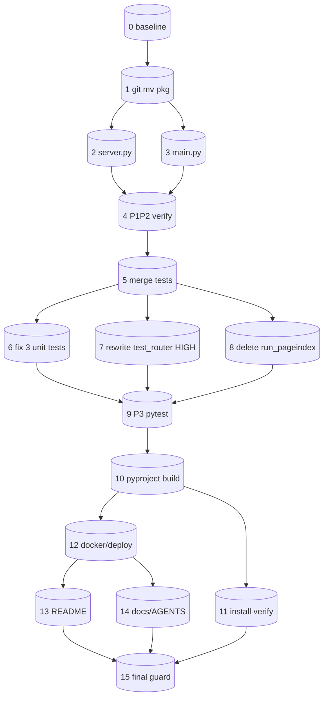
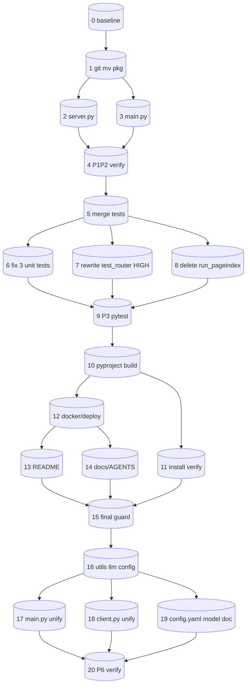

# Tasks: project-refactor（消除 fork 嵌套 + 包重命名 pageindex_mutil）

> 关联 spec：`docs/design-docs/PageIndex/project-refactor/spec.md`（§1-8 已完成）
> 迁移方案：**B 分阶段**（P1+P2 原子提交 / P3 / P4 / P5 各自独立提交）
> 纪律：行为保持型重构，Two-Agent（执行≠验证），先建 GREEN 基线再动。

## Baseline（已捕获 + 已补强，#0）
- 命令：`.venv/bin/python -m pytest -v`（默认 rootdir 自动收集 `tests/` + `PageIndex/tests/`）
- **补强后结果：43 collected → 43 passed / 0 failed / 0 skipped / 0 errors（1.96s）**
- 补强：pyproject 增加 `[dependency-groups] dev = [pytest>=8.0, pytest-asyncio>=0.23]` + `[tool.pytest.ini_options] asyncio_mode = "auto"`（PEP 735 现代 dev-dep 形式，uv 0.9.26 原生支持）。
- 9 个 test_router/test_super_tree 异步测试现已实跑且全 PASS——#7 高风险区域的验证已就位。
- 0 个 API-key/env 失败、0 assertion、0 import 失败。基线判定：**重构必须保持 43/43 绿**。

## Task List

### P0 — 基线（最先，阻塞性）

- [ ] 0. `test:` 建立 GREEN 基线（安全网）
  - Acceptance: `pytest -q` 输出捕获并记录通过数/失败数到本文件"Status Record"；若存在既有失败用例，列出清单告知用户（重构只承诺"不引入新失败"）
  - Dependencies: -
  - Risk: low
  - Evidence: `pytest -q` 完整 stdout

### P1+P2 — 原子提交（结构平移 + 入口/路径清理）

- [ ] 1. `config:` `git mv PageIndex/pageindex pageindex_mutil`
  - Acceptance: `ls pageindex_mutil/` 含 `__init__.py client.py page_index.py utils.py super_tree.py closet_index.py page_index_md.py retrieve.py config.yaml` 与 `agentic/`；`git log --follow pageindex_mutil/__init__.py` 显示历史保留
  - Dependencies: 0
  - Risk: low（git mv 单操作，虽涉及多文件但原子）

- [ ] 2. `feat:` 改写 `server.py` 入口
  - Acceptance: `from PageIndex.pageindex import PageIndexClient` → `from pageindex_mutil import PageIndexClient`；**删除** `sys.path.insert`（L19-20）两行；`grep -nE "sys\.path|PageIndex|from pageindex\b" server.py` 为空
  - Dependencies: 1
  - Risk: low

- [ ] 3. `feat:` 改写 `main.py` 入口
  - Acceptance: `from pageindex.utils import ...` → `from pageindex_mutil.utils import ...`；`from pageindex.page_index import page_index_main` → `from pageindex_mutil.page_index import page_index_main`；**删除** `sys.path.append(.../PageIndex)`（L16）；`grep -nE "sys\.path|PageIndex|from pageindex\b" main.py` 仅剩合法项
  - Dependencies: 1
  - Risk: low

- [ ] 4. `verify:` P1+P2 导入烟测 + grep 守卫
  - Acceptance: `python -c "from pageindex_mutil import PageIndexClient, page_index_main, md_to_tree"` 成功；`grep -rnE "from PageIndex|from pageindex\b|sys\.path\.(insert|append).*PageIndex" --include=*.py server.py main.py` 为空
  - Dependencies: 2, 3
  - Risk: low
  - **（P1+P2 到此为一个原子提交 commit）**

### P3 — 独立提交（测试合并 + test_router 重写 + 删冗余 CLI）

- [ ] 5. `test:` 合并测试 `git mv PageIndex/tests/test_*.py tests/`
  - Acceptance: `tests/` 含原 7 个 + `test_db.py`；`PageIndex/tests/` 为空
  - Dependencies: 4
  - Risk: low

- [ ] 6. `test:` 修正三个 agentic 单测 import
  - Acceptance: `test_planner_unit.py`/`test_strategies_unit.py`/`test_verifier_unit.py` 中 `from PageIndex.pageindex.agentic.X` → `from pageindex_mutil.agentic.X`；各自可 import
  - Dependencies: 5
  - Risk: low

- [ ] 7. `test:` 重写 `tests/test_router.py` 的 importlib 注入 ⚠️ 最高风险
  - Acceptance: `pageindex_path = .../"pageindex_mutil"`；所有 `spec_from_file_location("pageindex.utils", ...)` → `("pageindex_mutil.utils", ...)`；所有 `sys.modules["pageindex.utils"|"pageindex.closet_index"|...]` 键 → `pageindex_mutil.*`；删除冗余 `sys.path.insert` 上层注入；`pytest tests/test_router.py -q` 绿
  - Dependencies: 5
  - Risk: **high**（importlib 模拟最易断裂）

- [ ] 8. `cleanup:` 删除 `PageIndex/run_pageindex.py` + 清理空目录
  - Acceptance: `PageIndex/` 目录消失；`ls PageIndex` 报 No such file；`git status` 干净（除本阶段提交外）
  - Dependencies: 5
  - Risk: low

- [ ] 9. `verify:` P3 全量测试
  - Acceptance: `pytest -q` 全绿（≥ P0 基线通过数，无新增失败）
  - Dependencies: 6, 7, 8
  - Risk: medium
  - **（P3 到此为一个提交 commit）**

### P4 — 独立提交（打包/部署）

- [ ] 10. `config:` pyproject 补包发现声明
  - Acceptance: 新增 `[build-system] requires=["setuptools>=68","wheel"] build-backend="setuptools.build_meta"`；`[tool.setuptools.packages.find] include=["pageindex_mutil*"]`；`[tool.setuptools.package-data] pageindex_mutil=["config.yaml"]`；保留 `[project] name="pageindex-uv"` 与 `[tool.uv.index]`；`python -c "import tomllib; tomllib.loads(open('pyproject.toml','rb').read())"` 不报错
  - Dependencies: 9
  - Risk: medium（根治 sys.path hack 根因）

- [ ] 11. `verify:` 干净环境安装可用
  - Acceptance: `pip install -e .`（或 `uv pip install -e .`）成功后，新 shell `python -c "import pageindex_mutil"` 在仓库根可用（无需 sys.path）
  - Dependencies: 10
  - Risk: medium

- [ ] 12. `config:` 核对 Dockerfile / docker-compose / deploy
  - Acceptance: 无 `PageIndex/` 硬编码路径；`COPY . .` + `pip install -e "."` + `CMD ["python","server.py"]` 在新结构成立；`grep -rnE "PageIndex/pageindex|/PageIndex" Dockerfile docker-compose.yml deploy/` 为空
  - Dependencies: 10
  - Risk: low
  - **（P4 到此为一个提交 commit）**

### P5 — 独立提交（文档）

- [ ] 13. `docs:` README.md 路径与包名
  - Acceptance: 结构图/命令/import 示例改为 `pageindex_mutil`；**保留** VectifyAI/PageIndex 上游署名；`grep -nE "PageIndex/pageindex|from pageindex\b" README.md` 为空（署名行除外）
  - Dependencies: 12
  - Risk: low

- [ ] 14. `docs:` design-docs / AGENTS.md / CLAUDE.md 路径引用
  - Acceptance: 涉及 `PageIndex/pageindex` 的路径描述更新为新结构；`grep -rnE "PageIndex/pageindex" docs/ AGENTS.md CLAUDE.md` 为空（历史文档语义保留）
  - Dependencies: 12
  - Risk: low
  - **（P5 到此为一个提交 commit）**

### 最终守卫

- [ ] 15. `verify:` 最终 grep 守卫 + 烟测 + 全量测试
  - Acceptance: `grep -rnE "from PageIndex|from pageindex\b|sys\.path\.(insert|append).*PageIndex" --include=*.py . | grep -v .venv` 为空；`python -c "import pageindex_mutil"` ok；`python main.py --help` 正常；`pytest -q` 全绿
  - Dependencies: 13, 14, 11
  - Risk: low

### P6 — 独立提交（功能变更：LLM 配置统一 + 标准 OpenAI 默认）

> 在 P0–P5 重构稳定、安全网（pytest 全绿）建立后才执行。两轨分离：P6 为功能变更，不污染重构行为对比。

- [ ] 16. `feat:` utils.py 统一 LLM 配置源
  - Acceptance: 默认 `_BASE_URL = "https://api.openai.com/v1"`；新增 `configure_llm(api_key=None, base_url=None)` 重建 `_client`/`_async_client`；API key `OPENAI_API_KEY` 主 + `DASHSCOPE_API_KEY` 回退；保留 `llm_completion`/`llm_acompletion` 签名不变
  - Dependencies: 15
  - Risk: medium

- [ ] 17. `feat:` main.py 改用统一配置
  - Acceptance: 删除 main.py:24-40 的 `API_KEY`/`BASE_URL`/`MODEL_NAME` 复制与自建 `client = OpenAI(...)`，改为引用 `pageindex_mutil.utils` 的配置源；功能等价
  - Dependencies: 16
  - Risk: medium

- [ ] 18. `feat:` client.py 改用统一配置
  - Acceptance: 删除 client.py:46-50 的 `CHATGPT_API_KEY` 第三变体与自建逻辑，统一走 utils 配置；`PageIndexClient.__init__` 行为等价
  - Dependencies: 16
  - Risk: medium

- [ ] 19. `config:` config.yaml model 默认值文档化
  - Acceptance: config.yaml `model`/`retrieve_model` 保留可配；在文件头注释或 README 注明"指向标准 OpenAI 时须设 MODEL_NAME"；如调整默认值需同步 §9 A8
  - Dependencies: 16
  - Risk: low

- [ ] 20. `verify:` P6 烟测 + 配置单一性守卫 + 回归
  - Acceptance: `python -c "from pageindex_mutil.utils import configure_llm, llm_completion; configure_llm('sk-test','https://api.openai.com/v1')"` 不报错；`grep -rnE "OpenAI\(|DASHSCOPE_API_KEY|OPENAI_BASE_URL" --include=*.py . | grep -v .venv` 仅命中 `pageindex_mutil/utils.py`；`pytest -q` 全绿
  - Dependencies: 17, 18, 19
  - Risk: medium
  - **（P6 到此为一个提交 commit）**

## Execution Order

## 关键路径 / 高风险
- **关键路径（重构轨）**：0 → 1 → 4 → 5 → 9 → 10 → 15
- **P6 轨（功能变更，重构稳定后）**：15 → 16 → 17/18/19 → 20
- **高风险任务**：#7（test_router importlib 重写）—— 独立验证，断裂即 `git revert` P3 提交
- **总计**：21 个 task，5 个逻辑提交（P1+P2 / P3 / P4 / P5 / P6）

## Execution Mode
- **subagent-driven**（已确认）：code 阶段每批 task 由 leaf-executor 子代理执行 → 产出 handoff.md（NEEDS_INDEPENDENT_VERIFICATION）→ 不同 verifier 子代理独立跑守卫 → quality-gate。
- 两轨分离：P0–P5（重构，行为保持）与 P6（LLM 功能变更）各自独立提交与验证。

## Status Record

| Task | Status | Start | End | Notes |
|------|--------|-------|-----|-------|
| 0 | ✅ done | - | - | baseline: 43→34 pass/9 fail(全为缺 pytest-asyncio，env 性)；pytest 已补装 venv |
| 1 | pending | - | - | - |
| 2 | pending | - | - | - |
| 3 | pending | - | - | - |
| 4 | pending | - | - | - |
| 5 | pending | - | - | - |
| 6 | pending | - | - | - |
| 7 | pending | - | - | - |
| 8 | pending | - | - | - |
| 9 | pending | - | - | - |
| 10 | pending | - | - | - |
| 11 | pending | - | - | - |
| 12 | pending | - | - | - |
| 13 | pending | - | - | - |
| 14 | pending | - | - | - |
| 15 | pending | - | - | - |
| 16 | pending | - | - | - |
| 17 | pending | - | - | - |
| 18 | pending | - | - | - |
| 19 | pending | - | - | - |
| 20 | pending | - | - | - |
